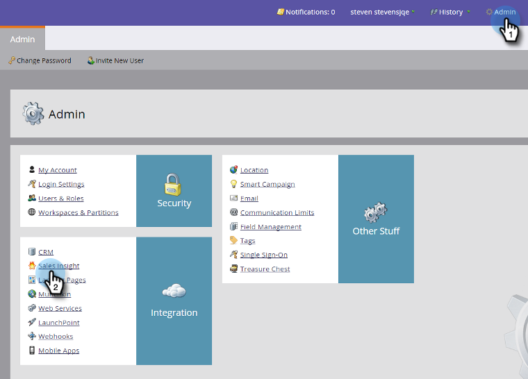

# Emitir uma licença do complemento de email do Marketo {#issue-a-marketo-email-add-in-license}

Qualquer pessoa que deseje usar o Suplemento Marketo Email Outlook deve primeiro receber uma licença. Há duas maneiras de fornecer a licença.

* **[Instalação da chave da empresa](/help/marketo/product-docs/marketo-sales-insight/msi-outlook-plugin/install-the-marketo-add-in-for-outlook-with-an-enterprise-key.md)**: Use esse método quando os representantes de vendas não tiverem direitos de administrador para seus laptops corporativos e não puderem instalar plug-ins, software etc. sobre isso. Nesse caso, o Administrador do Marketo emite licenças para uma lista de usuários autorizados. Em seguida, a equipe de TI implanta remotamente o plug-in em todos os computadores dos usuários autorizados usando a chave empresarial. O usuário do plug-in o autoriza.
* **[Instalação do código de registro](/help/marketo/product-docs/marketo-sales-insight/msi-outlook-plugin/install-the-marketo-email-add-in-for-outlook-with-a-registration-code.md)**: Use esse método quando os representantes de vendas tiverem direitos de administrador em seu laptop corporativo e puderem instalar plug-ins, software etc. sobre isso. Para esse processo, o administrador do Marketo emite licenças para uma lista de usuários autorizados e envia emails de registro diretamente com links de download. O representante de vendas recebe um email com um link de download de plug-in e um URL de registro exclusivo.

>[!AVAILABILITY]
>
>Nem todos os clientes compraram essa funcionalidade. Confira os detalhes com seu representante de vendas.

>[!NOTE]
>
>**Permissões de administrador necessárias**

1. Em Minha Marketo, clique em Admin e, em seguida, em Sales Insight.

1. Em **Suplemento de email** clique em **Emitir licença**.

   

1. Insira os endereços de email dos representantes de vendas que precisam ser autorizados a usar o plug-in e clique em **Emitir licença**.

   >

   >[!TIP]
   >
   >É possível inserir vários endereços de email separados por vírgula.

   >[!NOTE]
   >
   >Para instalar o plug-in remotamente, deixe a caixa de seleção desmarcada e envie sua equipe de TI para [Chave da empresa](/help/marketo/product-docs/marketo-sales-insight/msi-outlook-plugin/install-the-marketo-add-in-for-outlook-with-an-enterprise-key.md).
   >
   >Se seus representantes de vendas tiverem acesso de administrador aos computadores, marque a caixa e você acabou!

>[!MORELIKETHIS]
>
>* [Instalar o complemento Marketo para Outlook com uma chave corporativa](/help/marketo/product-docs/marketo-sales-insight/msi-outlook-plugin/install-the-marketo-add-in-for-outlook-with-an-enterprise-key.md)
>* [Instalar o Suplemento de Email do Marketo para Outlook com um Código de Registro](/help/marketo/product-docs/marketo-sales-insight/msi-outlook-plugin/install-the-marketo-email-add-in-for-outlook-with-a-registration-code.md)
>* [Atualizar o Suplemento de Email do Marketo para Outlook](/help/marketo/product-docs/marketo-sales-insight/msi-outlook-plugin/upgrade-your-marketo-email-add-in-for-outlook.md)

