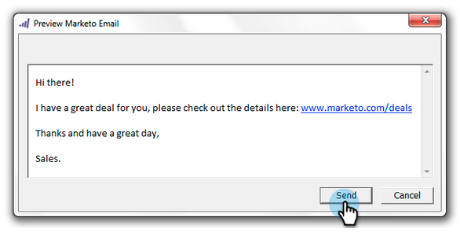

# Enviar e Acompanhar um Email com o Suplemento de Email para [!DNL Outlook] {#send-and-track-an-email-with-the-email-add-in-for-outlook}

Você pode enviar e rastrear emails com o Marketo diretamente do [!DNL Outlook].

>[!PREREQUISITES]
>
>Caso ainda não o tenha feito, instale o [suplemento de email do Marketo para [!DNL Outlook]](/help/marketo/product-docs/marketo-sales-insight/msi-outlook-plugin/install-the-marketo-email-add-in-for-outlook-with-a-registration-code.md).

>[!NOTE]
>
>Os recursos de Ações do Sales Insight, incluindo Enviar email de vendas, Adicionar à campanha de vendas e Tarefas, não estão disponíveis nos plug-ins de email do Sales Insight para Gmail e Outlook. No momento, os usuários só têm a capacidade de enviar um email rastreável com ou sem um modelo de email do Marketo por meio de seu cliente de email ao usar os plug-ins de email do Sales Insight.

1. Abra o Microsoft Outlook e crie um novo email.

   

   >[!CAUTION]
   >
   >Se você incluir vários recipients no email, todas as atividades serão rastreadas no primeiro recipient.

1. Redija seu email normalmente e clique em **[!UICONTROL Enviar e Rastrear]**.

   

   >[!NOTE]
   >
   >Se você enviar um email para alguém que não existe na instância do Marketo, um Registro de pessoa será criado automaticamente para ela. O sobrenome dele será sempre &#39;mktUnknown&#39; para que você possa encontrá-los facilmente.

   >[!TIP]
   >
   >Se quiser usar um modelo do Marketo, consulte [Enviar e Rastrear de [!DNL Outlook] Usando um Modelo](/help/marketo/product-docs/marketo-sales-insight/msi-outlook-plugin/send-and-track-from-outlook-using-a-marketo-template.md).

1. Dê uma olhada na visualização e clique em **[!UICONTROL Enviar]**.

   

   >[!CAUTION]
   >
   >A tecnologia antisspam geralmente rejeita aberturas e cliques que ocorrem dentro de 20 segundos após o envio do email. Portanto, aguarde pelo menos esse tempo para abrir/clicar enquanto testa.

   Para ver quem recebeu seus emails enviados pelo [!DNL Outlook], crie uma lista inteligente usando o filtro &quot;[!UICONTROL Email de Vendas Enviado]&quot;.

   

É fácil assim! Embora esse email tenha sido enviado pelo [!DNL Outlook] de um vendedor, ele será rastreado no Marketo.

>[!MORELIKETHIS]
>
>[Registrar Emails De Entrada De Seus Clientes Potenciais No Marketo](/help/marketo/product-docs/marketo-sales-insight/using-msi/log-inbound-mail-from-your-leads-in-marketo.md)
