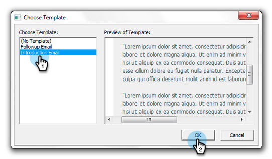

# Enviar e Rastrear de [!DNL Outlook] Usando um Modelo do Marketo {#send-and-track-from-outlook-using-a-marketo-template}

Se sua equipe de marketing disponibilizou modelos, veja como usá-los para economizar tempo ao redigir seus emails.

>[!NOTE]
>
>Os recursos de Ações do Sales Insight, incluindo Enviar email de vendas, Adicionar à campanha de vendas e Tarefas, não estão disponíveis nos plug-ins de email do Sales Insight para Gmail e Outlook. No momento, os usuários só têm a capacidade de enviar um email rastreável com ou sem um modelo de email do Marketo por meio de seu cliente de email ao usar os plug-ins de email do Sales Insight.

1. Abra o Microsoft Outlook e clique em **Mensagem do Marketo**.

   

1. Selecione o modelo desejado, visualize-o e clique em **[!UICONTROL OK]**.

   

1. Faça todas as edições e clique em **[!UICONTROL Enviar e Rastrear]**.

   

   >[!NOTE]
   >
   >Os tokens não são compatíveis com o suplemento. Remova qualquer item que possa estar no modelo.

1. Confira a visualização, verifique se está boa e clique em **[!UICONTROL Enviar]**.

   

   E aí está! Você foi capaz de economizar um monte de tempo usando modelos que sua equipe de marketing super incrível fez para você.

>[!MORELIKETHIS]
>
>[Registrar Emails De Entrada De Seus Clientes Potenciais No Marketo](/help/marketo/product-docs/marketo-sales-insight/using-msi/log-inbound-mail-from-your-leads-in-marketo.md)
