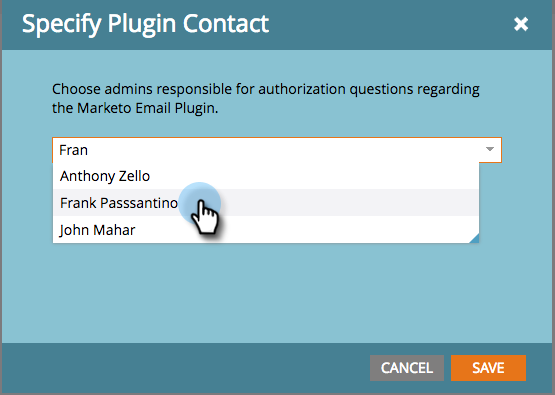

# Especificar administradores do plug-in Insight de vendas do Marketo {#specify-marketo-sales-insight-plugin-admins}

Você pode especificar quais contatos deseja que apareçam no aviso por email enviado aos usuários quando os convidar para configurar o MSI no Outlook.

1. Em Meu Marketo, clique em **Admin** e depois em **Sales Insight**.

   

1. Clique na guia **Suplemento de email**.

   

1. Clique em **Especificar Contato de Plug-in**.

   

1. Clique em para especificar os contatos do plug-in.

   

1. Clique em **Salvar**.

   

1. Os contatos selecionados serão listados no email que os representantes de vendas recebem durante o processo de autorização.

   

   Perfeito!
