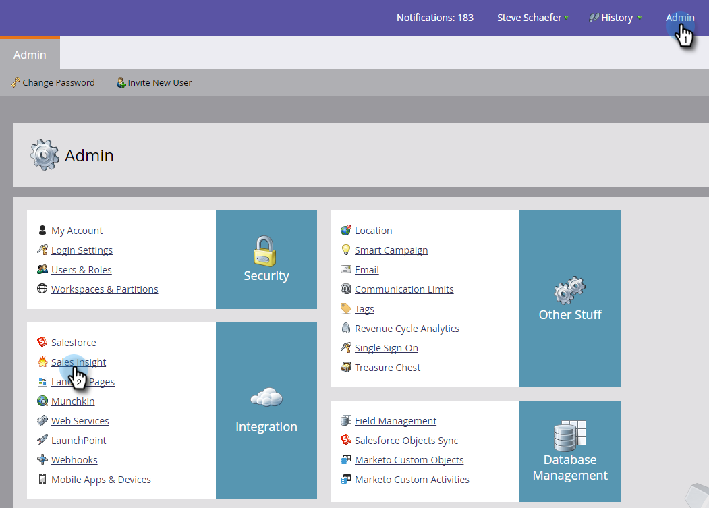
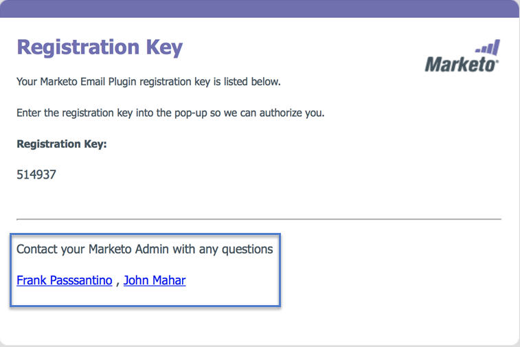

# Especificar Administradores Do Plug-In Marketo [!UICONTROL Sales Insight] {#specify-marketo-sales-insight-plugin-admins}

Você pode especificar quais contatos deseja que apareçam no aviso de email enviado aos usuários quando os convidar para configurar o MSI em [!DNL Outlook].

1. Em Meu Marketo, clique em **[!UICONTROL Admin]** e depois em **[!UICONTROL Sales Insight]**.

   

1. Clique na guia **[!UICONTROL Suplemento de email]**.

   

1. Clique em **[!UICONTROL Especificar Contato de Plug-in]**.

   

1. Clique em para especificar os contatos do plug-in.

   

1. Clique em **[!UICONTROL Salvar]**.

   

1. Os contatos selecionados serão listados no email que os representantes de vendas recebem durante o processo de autorização.

   

   Perfeito!
