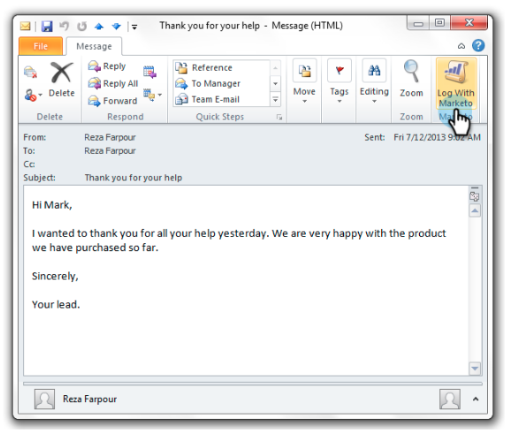

# Registrar emails de entrada de leads no Marketo {#log-inbound-mail-from-your-leads-in-marketo}

Você pode registrar respostas de seus clientes em potencial diretamente no [!DNL Outlook] com o Suplemento de Email do Marketo.

## Do Aplicativo [!DNL Outlook] Principal {#from-the-main-outlook-application}

1. Selecione o email que deseja registrar e clique em **[!UICONTROL Registrar com o Marketo]**.

>[!TIP]
>
>Você também pode clicar com o botão direito do mouse em uma mensagem e em **[!UICONTROL Registrar com o Marketo]**.

Você deve ver uma confirmação.

## Do próprio email {#from-the-email-itself}

Se você abriu o email, basta clicar no botão **[!UICONTROL Fazer logon com o Marketo]** a partir daí.

Você deve ver a mesma confirmação que o outro método.

Registre as respostas do seu cliente potencial para adicioná-lo ao seu histórico no Marketo.

>[!MORELIKETHIS]
>
>* [Enviar e Rastrear um Email com o Suplemento de Email do Marketo para [!DNL Outlook]](/help/marketo/product-docs/marketo-sales-insight/msi-outlook-plugin/send-and-track-an-email-with-the-email-add-in-for-outlook.md)
>* [Enviar e Rastrear de [!DNL Outlook] Usando um Modelo do Marketo](/help/marketo/product-docs/marketo-sales-insight/msi-outlook-plugin/send-and-track-from-outlook-using-a-marketo-template.md)
