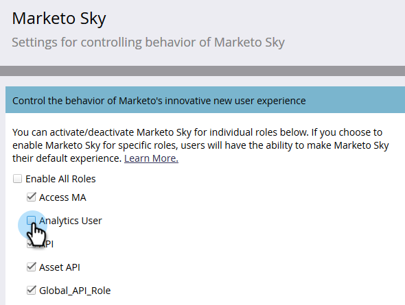

# Ativação de funções para Marketo Sky {#enabling-roles-for-marketo-sky}

Para utilizar o Marketo Sky, as funções para os usuários desejados devem ser ativadas.

>[!NOTE]
>
>**Permissões de administrador necessárias**

1. No Marketo Classic, clique em **Admin**.

   

1. Na árvore, selecione **Marketo Sky**.

   

1. Selecione as funções desejadas.

   

As funções selecionadas agora podem usar Marketo Sky.
