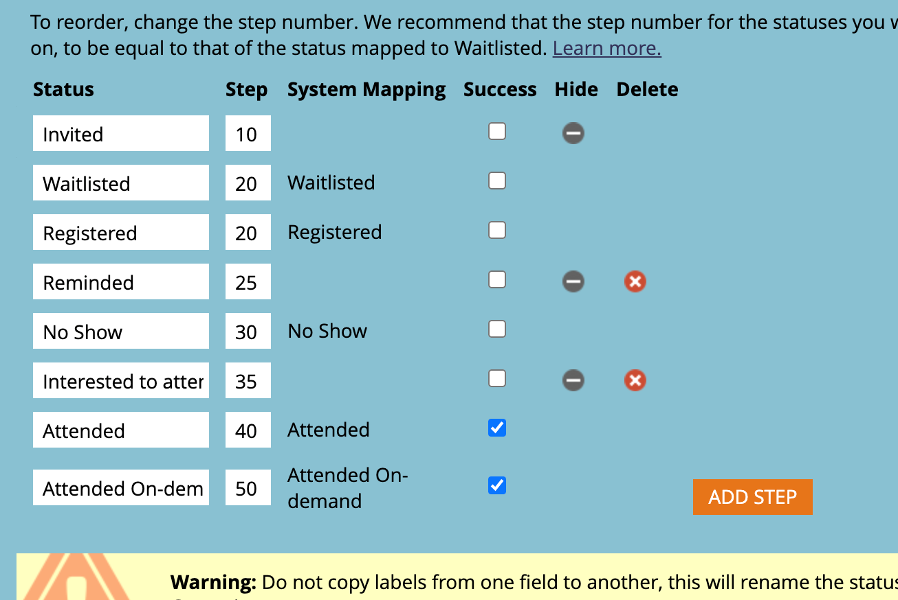

# Como entender o rastreamento de metas e os registros projetados {#understanding-goal-tracking-and-projected-registrations}

Depois [definição de metas de evento](/help/marketo/product-docs/marketo-sky/setting-event-goals.md) e enviar convites por meio de um [campanha inteligente](/help/marketo/product-docs/core-marketo-concepts/smart-campaigns/creating-a-smart-campaign/create-a-new-smart-campaign.md), veja como rastrear o progresso da meta e entender as previsões da Marketo.

>[!NOTE]
>
>Quando um programa de evento é criado na experiência do Marketo Classic, a data de início do evento é padronizada atualmente para a data de criação do evento. Como os registros projetados levam em consideração a quantidade de tempo antes da data de início de um evento, esses números podem não ser precisos se a data de início e a data de criação forem iguais (a menos que sejam definidas intencionalmente).

## Rastreamento de metas e registros projetados {#goal-tracking-and-projected-registrations}

1. Você pode encontrar detalhes de rastreamento de meta na seção **[!UICONTROL Relatórios]** do seu programa de eventos. Neste exemplo específico, há 150 membros registrados até agora contra uma meta de 200 (75%).

   

Você também verá seu **[!UICONTROL Projetado]** registros. Passe o mouse sobre o ícone de informações para ver a análise desse número por segmento Probabilidade .

>[!NOTE]
>
>O gráfico Participante e Superior permanecerá vazio até o dia do evento.

1. Clique na opção Gráfico para alternar para uma análise dos membros por probabilidade de registro. Você verá porcentagens de registro atuais para cada segmento, em comparação à porcentagem média para esse segmento em seus programas anteriores.

   

Todos os membros (registrados e ainda não registrados) são classificados de acordo com a probabilidade de registro. Passe o mouse sobre o ícone de informações para ver como essas categorias de probabilidade são definidas.

>[!NOTE]
>
>Os números de previsão são atualizados a cada 24 horas até o dia do evento. Qualquer membro que esteja listado como _Processamento_ serão incluídos no próximo ciclo de cálculo.

## Programas similares {#similar-programs}

Você pode obter alguns insights sobre seu evento atual observando o desempenho de programas semelhantes no passado. Esta seção mostra até 5 programas semelhantes dos últimos 6 meses, com o número/porcentagem de membros que foram _Registrado_ ou superior.

No cálculo de programas semelhantes, incluímos os seguintes fatores, entre outros:

* Tipo de programa
* Canal de programa
* Tamanho do público-alvo
* Marcas de programa
* Duração desde a criação do evento até o início do evento
* Duração do evento

   

## Recomendações {#recommendations}

Na parte superior da página Relatórios, você pode encontrar recomendações orientadas por IA/ML com base no seu progresso. Verifique periodicamente se há dicas e insights úteis!

## Previsões de nível de pessoa {#person-level-predictions}

Clique no botão **[!UICONTROL Membros]** para exibir todos os membros do programa. Passe o mouse sobre **[!UICONTROL Probabilidade de registro]** ou **[!UICONTROL Probabilidade de participação]** para ver as porcentagens e as categorizações exatas. Você pode então tomar medidas em relação aos membros de uma categoria específica (por exemplo, todos na categoria &quot;Menos provável&quot; de registrar) e direcioná-los especificamente para aumentar potencialmente seus números de registro.

>[!NOTE]
>
>A probabilidade individual leva em consideração mais de 40 fatores pessoais, incluindo atributos de perfil, atividade da pessoa e atividades convidadas/registradas/assistidas anteriores.

## Perguntas frequentes {#faq}

**P: Qual é o segmento?**

A: Provavelmente, registrar é um valor de 0 a 100. Cada pessoa que é membro do programa de eventos terá um valor de probabilidade entre 0 e 100.

Colocamos valores de probabilidade em três segmentos:

* Probabilidade de registro > 50% = segmento altamente provável
* Probabilidade de registro > 25% a &lt;50% = Segmento provável
* Probabilidade de registro &lt;25% = Menos provável de segmento

Quando uma pessoa tem probabilidade de se registrar, a previsão cairá em um desses segmentos (cada pessoa que é membro de um programa cairá em um deles). Por exemplo, se um programa de evento tiver 1000 membros com base nas previsões de probabilidade, esses 1000 serão distribuídos no _Muito provável_, _Provável_ ou _Menos provável_ segmentos.

Portanto, as pessoas que caírem no segmento Muito provável terão mais chances de se registrar no evento.

Conversão para registro = número de pessoas no segmento registradas dividido por número de pessoas que se enquadram no segmento (por exemplo, se 100 pessoas se enquadram no segmento Altamente provável e 60 se registram, a taxa de conversão é de 60%).

A % de conversão para registro seguirá este padrão: Altamente provável > Provável > Menos provável.

**P: Como usar os insights?**

A: As melhores práticas implicam o seguinte:

i. Você cria um programa e, em seguida, uma Campanha Inteligente usa filtros preditivos com &quot;maior que X&quot;, o que resultaria em uma certa quantidade de pessoas (digamos 1000) e você executaria a campanha.

ii. Após 24 horas, no [!UICONTROL Relatórios] você pode ver os registros projetados que são calculados com base na probabilidade de registrar valores de todas as pessoas que estão atualmente convidadas.

iii. Se os registros projetados forem menores que a meta, você terá que convidar mais pessoas. Neste ponto, você pode ver os insights que informam qual foi o limite que funcionou em programas anteriores.

iv. Você pode criar uma nova Campanha inteligente com esse limite para convidar mais pessoas.

v. A qualquer momento, se você quiser entender por que um número projetado está sendo exibido, poderá alternar para ver a distribuição de público-alvo nos segmentos, suas taxas de conversão do passado e aplicar essas taxas de conversão ao público-alvo atual (veja a captura de tela abaixo).

**P: O que é o gráfico Segmentos por Registro?**

A: Três barras, cada uma representando um segmento (Altamente provável, provável, menos provável).

**Linha pontilhada violeta:** Taxa média de conversação para registrar nesse segmento, com base em programas similares anteriores.

**Barra azul:** Porcentagem de registro de todas as pessoas nesse segmento.

Por exemplo, digamos que 100 pessoas têm probabilidade de registrar > 50% e 60 dessas 100 pessoas registradas. É altamente provável que tenha conversão de 60%. Assim, todos os membros adicionados ao programa têm probabilidade de registrar valores, então eles são colocados em segmentos e, de acordo com o número de pessoas registradas em cada taxa de conversão de segmento, é calculado.

**P: O que significa &quot;Registrado e maior&quot;?**

A: Qualquer pessoa que esteja listada como registrada ou qualquer outro status com um número de etapa igual ou superior.

Você pode criar novos status de progressão para um programa de evento, mas mapeamos esses status com status padrão. Considere um caso em que uma pessoa é transferida de convidada para lembrada, o que é uma etapa mais alta do que o registro. Essa pessoa também será considerada registrada e mostrada no rastreamento da meta.

**P: Como são calculados os registros projetados?**

A: Veja abaixo.

