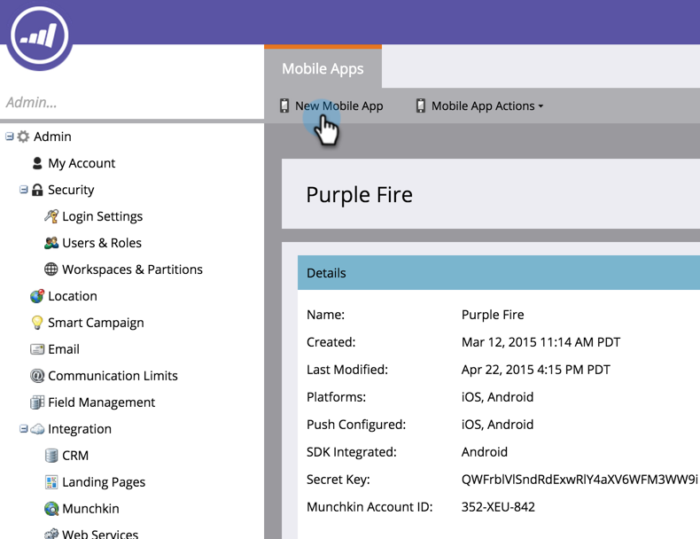

# Adicionar um aplicativo móvel {#add-a-mobile-app}

Envie notificações por push para sua base de clientes conectando seu aplicativo móvel ao Marketo.

Os aplicativos normalmente começam em um ambiente de sandbox, onde o desenvolvimento e o teste iniciais são realizados. Os desenvolvedores usam um ambiente de produção para criar o aplicativo final que será usado pelos clientes. Você deve selecionar o certificado de notificação apropriado ao adicionar um aplicativo móvel (consulte a etapa 4 abaixo).

>[!AVAILABILITY]
>
>
>Nem todos os usuários do Marketo Engage compraram essa funcionalidade. Entre em contato com a equipe de conta da Adobe (seu gerente de conta) para obter mais detalhes.

1. Clique em **[!UICONTROL Administrador]**.

   

1. Clique em **[!UICONTROL Aplicativos e dispositivos móveis]**.

   

1. Clique em **[!UICONTROL Novo aplicativo móvel]**.

   

1. Insira um nome. Na lista suspensa **[!UICONTROL Tipo]**, selecione o tipo de ambiente que você está usando—[!UICONTROL Sandbox] ou [!UICONTROL Produção]. Clique em **[!UICONTROL Salvar]**.

   

   >[!NOTE]
   >
   >Recomendamos que você use um certificado de notificação de [!UICONTROL Produção] em um ambiente de [!UICONTROL Produção]. Um certificado de [!UICONTROL Sandbox] será instalado em um ambiente de [!UICONTROL Produção] sem problemas, mas você não receberá notificações. Em caso de dúvidas sobre seu ambiente ou certificado de notificação, entre em contato com o administrador do Marketo ou o desenvolvedor de aplicativos móveis.

   Legal! Agora vamos configurar seu aplicativo para funcionar com dispositivos Android e iOS.

>[!MORELIKETHIS]
>
>* [Configurar o acesso por push do Android para aplicativos móveis](/help/marketo/product-docs/mobile-marketing/admin/configure-mobile-app-android-push-access.md)
>* [Configurar o acesso por push do iOS para aplicativos móveis](/help/marketo/product-docs/mobile-marketing/admin/configure-mobile-app-ios-push-access.md)
