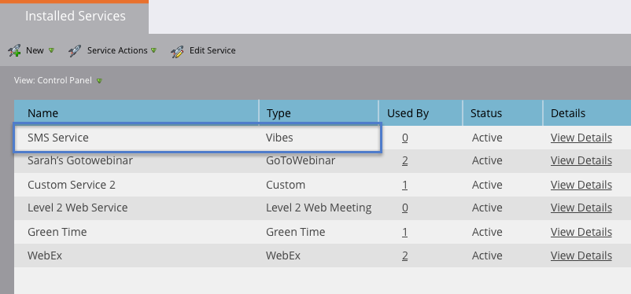

# Adicionar Vibes como um Serviço LaunchPoint {#add-vibes-as-a-launchpoint-service}

Você pode enviar mensagens SMS para as pessoas em suas listas Vibes e usar a atividade SMS para acionar e filtrar campanhas. Primeiro, é necessário adicionar Vibes como um serviço do LaunchPoint.

>[!NOTE]
>
>**Permissões de administrador necessárias**

>[!NOTE]
>
>Você precisa de permissões de Administrador do Marketing e de uma conta ativa do Vibes para concluir esta configuração. As credenciais solicitadas na Etapa 4 abaixo são as credenciais da sua conta Vibes.

1. Em Meu Marketo, clique em **Admin** e **LaunchPoint**.

   

1. Clique em **Novo** e **Novo serviço**.

   

1. Digite um nome para exibição e, no menu suspenso, selecione **Vibes**.

   

1. Em Configurações, digite seu nome de usuário, senha e chave de Empresa da API do Vibes. Clique em **Criar**.

   

   O novo serviço SMS agora é exibido na lista Serviços instalados.

   

