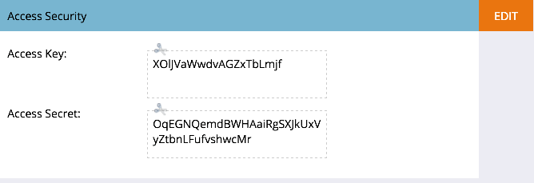

# Autenticar a segurança do Mobile Access {#authenticate-mobile-access-security}

Para melhorar a segurança dos usuários do Mobile, o Marketo fornece duas novas IDs: a chave de acesso e o segredo de acesso. Essa ajuda garante que os usuários que fazem logon em seu aplicativo sejam realmente quem parecem ser.

Para ativar as IDs, é necessário adquirir os códigos e fornecê-los ao departamento de TI para que eles possam configurar uma correspondência segura.

>[!NOTE]
>
>**Pré-requisitos**
>
>Para ativar este recurso, entre em contato com o Suporte e solicite &quot;Vespa Secure Mode&quot;.

1. Em Marketo, selecione **Admin **e clique em Aplicativos e dispositivos **móveis**.

   

1. Selecione o aplicativo móvel para o qual deseja habilitar o acesso seguro.

   

1. Role para baixo e, na seção Access Security (Segurança de acesso), clique em **Edit (Editar**).

   

1. Marque a caixa de seleção** Ativar segurança**. Clique em **Salvar**.

   

1. A área Segurança de acesso agora exibe os dois novos códigos. Certifique-se de enviá-los ao seu departamento de TI.

   

