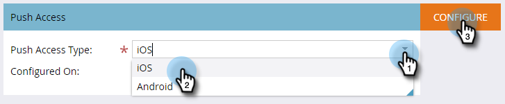

# Configurar o acesso por push do iOS para aplicativos móveis {#configure-mobile-app-ios-push-access}

1. Clique em **[!UICONTROL Administrador]**.

   

1. Selecione **[!UICONTROL Aplicativos móveis]**.

   

1. Selecione o aplicativo móvel desejado.

   

1. Em [!UICONTROL Tipo de Acesso por Push], selecione iOS e clique em **[!UICONTROL Configurar]**.

   

   >[!NOTE]
   >
   >Você precisará de um **[!UICONTROL Certificado]** e uma **[!UICONTROL Senha]** do desenvolvedor de aplicativos móveis. O desenvolvedor recebe isso ao fazer logon no Centro de membros do desenvolvedor do Apple, configurar e baixar um certificado de notificação por push para seu aplicativo e exportar o conteúdo. O desenvolvedor define a senha ao fazer a exportação. **IMPORTANTE**: o certificado deve ser apropriado para o tipo de ambiente que você está usando — Sandbox ou Produção. Verifique isso com o administrador do Marketo ou com o desenvolvedor de aplicativos móveis.

1. Selecione o [!UICONTROL Certificado], digite a [!UICONTROL Senha] e clique em **[!UICONTROL Salvar]**.

   

Muito bem! Certifique-se de configurar o aplicativo com o Android.

>[!MORELIKETHIS]
>
>[Configurar o acesso por push do Android para aplicativos móveis](/help/marketo/product-docs/mobile-marketing/admin/configure-mobile-app-android-push-access.md)
