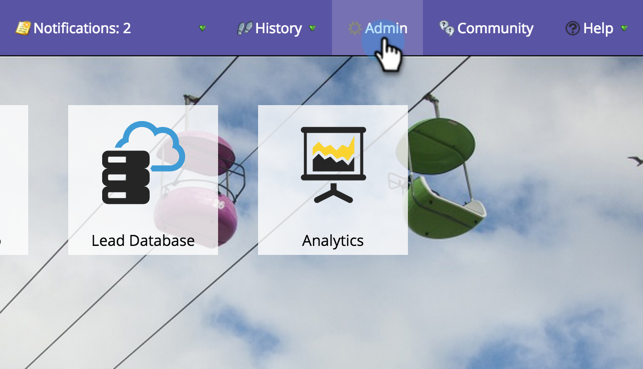
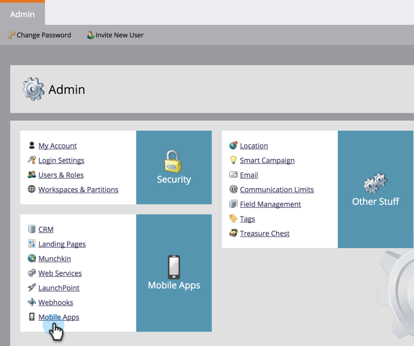
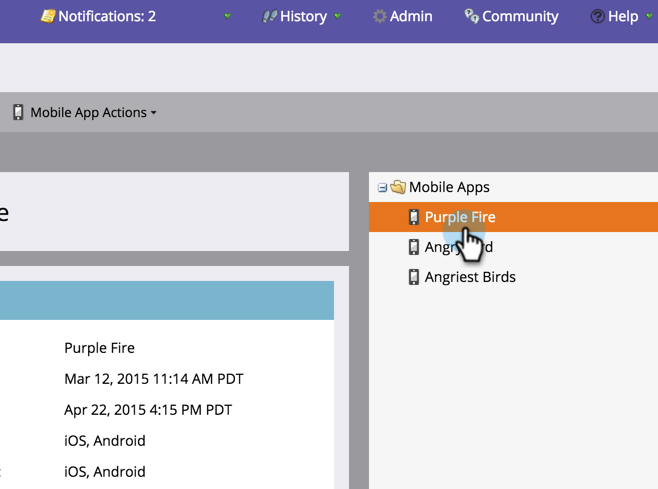
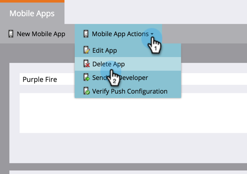

# Excluir aplicativo móvel {#delete-mobile-app}

1. Clique em **[!UICONTROL Administrador]**.

   

1. Selecione **[!UICONTROL Aplicativos móveis]**.

   

1. Selecione o aplicativo móvel desejado.

   

1. Clique em **[!UICONTROL Ações do Aplicativo Móvel]** e selecione **[!UICONTROL Excluir Aplicativo]**.

   

1. Confirme clicando em **[!UICONTROL Excluir]**.

   

Ta-da! A notificação por push não pode mais ser enviada deste aplicativo móvel.
