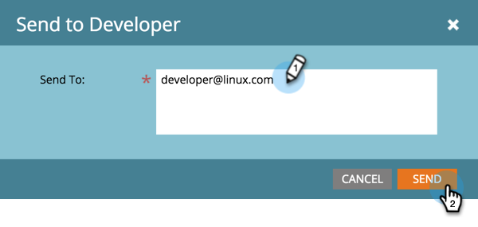

# Enviar código do SDK para um desenvolvedor {#send-sdk-code-to-a-developer}

Antes de criar mensagens no aplicativo ou notificações por push, você deve ter seu desenvolvedor configurado e inicializar o SDK do aplicativo móvel para as plataformas Android e iOS.

* [Instruções para o Android](https://experienceleague.adobe.com/en/docs/marketo-developer/marketo/mobile/installation#how-to-install-marketo-sdk-on-android)
* [Instruções para o iOS](https://experienceleague.adobe.com/en/docs/marketo-developer/marketo/mobile/installation#how-to-install-marketo-sdk-on-ios)

## Enviar código do SDK para um desenvolvedor {#send-sdk-code-to-a-developer-1}

Às vezes, um administrador precisa enviar algum código SDK para um desenvolvedor.

Veja como fazer isso.

1. Clique em **[!UICONTROL Administrador]**.

   

1. Selecione **[!UICONTROL Aplicativos móveis]**.

   

1. Selecione o aplicativo móvel desejado.

   

1. Clique em **[!UICONTROL Ações do Aplicativo Móvel]** e selecione **[!UICONTROL Enviar para Desenvolvedor]**.

   

1. Digite um endereço de email e clique em **[!UICONTROL Enviar]**.

   

   O código SDK será enviado agora para o desenvolvedor.
