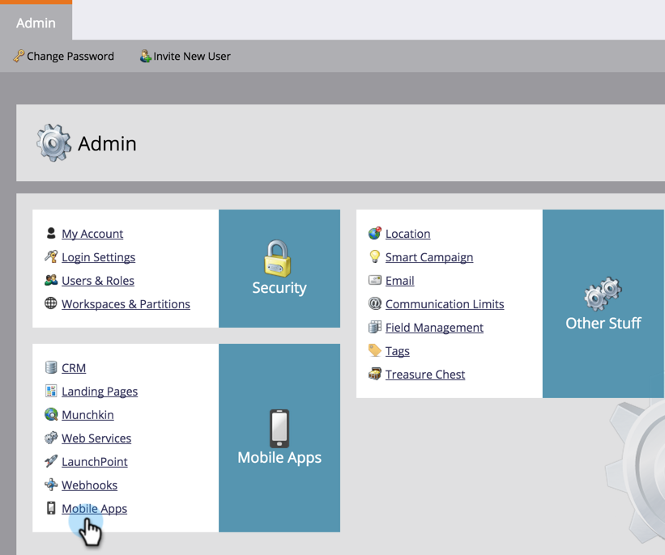

# Verifique a configuração de push {#verify-push-configuration}

>[!PREREQUISITES]
>
>Seu desenvolvedor móvel deve ter adicionado o código SDK do Marketo ao seu aplicativo móvel.

Verifique a configuração de push para garantir que tudo esteja sincronizado corretamente.

1. Clique em **Admin**.

   

1. Selecione **Aplicativos móveis**.

   

1. Selecione o aplicativo móvel desejado.

   

1. Clique em **Ações do aplicativo móvel** e selecione **Verificar configuração de push**.

   

1. Confirme se as plataformas desejadas foram lidas e clique em **Fechar**.

   

Tudo pronto! Agora você pode start para enviar notificações por push.

>[!MORELIKETHIS]
>
>[Criar uma notificação por push](/help/marketo/product-docs/mobile-marketing/push-notifications/create-a-push-notification.md)
