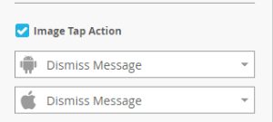

# Adicionar imagens de mensagens no aplicativo {#add-in-app-message-images}

Aqui é onde você escolhe e personaliza suas imagens de mensagens no aplicativo.

1. Selecione a mensagem no aplicativo e clique em **Editar rascunho**.

   

1. Escolha um dos seis modelos na guia Layout. Há três opções de Pop-Up e três de Tela inteira.

   >[!TIP]
   >
   >Qual é a diferença entre os modelos? Consulte [Escolher um layout para sua mensagem](/help/marketo/product-docs/mobile-marketing/in-app-messages/creating-in-app-messages/choose-a-layout-for-your-in-app-message.md) no aplicativo antes de começar.

   

1. Clique na guia **Estilo** e clique na área de imagem do modelo.

   

1. Clique em **Selecionar imagem**.

   

1. Selecione sua imagem no Design Studio e clique em **Selecionar**.

   

   >[!NOTE]
   >
   >O tamanho da imagem é limitado a 1440 x 2560 px e 5 MB.

1. Mude de ideia e deseja usar uma imagem diferente? Sem problemas. Clique no **X** ao lado do nome do arquivo de imagem.

   

1. Clique em **Remover**. Agora, você pode escolher outro.

   

1. Com a imagem desejada no lugar, em Propriedades da imagem, selecione um botão para ajustar a imagem por Altura, Largura ou Ambos.

   

1. Como opção, aplique uma borda de imagem. A configuração padrão é **Desativado**. Primeiro, selecione a cor clicando nela ou digitando os números hexadecimais ou RGB no seletor de cores.

   

1. Clique nas setas para alterar a largura da borda, em pixels. Vocês verão isso mudar na imagem.

   

1. Selecione um raio de canto usando o controle deslizante. Selecione uma posição da esquerda para a direita: 0, 4, 8, 12 ou 16 pixels. A seleção de 8 pixels (centro) é o padrão.

   

1. Selecione uma margem (ligada ou desligada). **On** é a configuração padrão.

   

1. Marque a caixa para definir uma ação de toque de imagem.

   

1. Há uma ação separada para cada plataforma (consulte Nota).

   

1. Clique em cada lista suspensa para exibir as opções. Selecione um.

   

   >[!NOTE]
   >
   >Para ações de toque para imagens, botões ou planos de fundo, é possível configurar ações diferentes para plataformas Apple e Android. Por exemplo, links profundos são tratados de forma diferente para Apple e Android. Se a mensagem for enviada somente para uma plataforma ou outra, deixe a outra na configuração padrão ou selecione **Nenhum**.

Ótimo trabalho! Agora, é hora de [criar o texto para sua mensagem](/help/marketo/product-docs/mobile-marketing/in-app-messages/creating-in-app-messages/create-in-app-message-text.md)no aplicativo.

>[!MORELIKETHIS]
>
>* [Como entender as mensagens no aplicativo](/help/marketo/product-docs/mobile-marketing/in-app-messages/understanding-in-app-messages.md)
>* [Escolha um layout para sua mensagem no aplicativo](/help/marketo/product-docs/mobile-marketing/in-app-messages/creating-in-app-messages/choose-a-layout-for-your-in-app-message.md)

