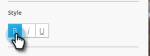
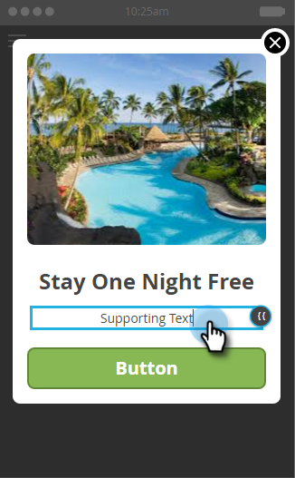

# Criar texto de mensagem no aplicativo {#create-in-app-message-text}

Clique na área de texto para trabalhar com seu estilo de texto e conteúdo.

>[!CAUTION]
>
>Recomendamos não usar emojis no texto, pois eles não são totalmente compatíveis no momento.

1. Clique no Texto principal para editar em linha.

   

1. Escolha a cor do texto clicando nela ou digitando os números hexadecimais ou de RGB no seletor de cores.

   

1. Clique nas setas para selecionar um tamanho de texto.

   

   >[!CAUTION]
   >
   >Um tamanho de texto muito grande pode ultrapassar o máximo de três linhas visíveis de texto.

1. Escolha um estilo de tipo opcional, com ênfase: **Negrito**, _Itálico_ ou Sublinhado.

   

1. Escolha o alinhamento do texto: Esquerda, Centralizado, Direita. Centralizado é o padrão.

   

   >[!NOTE]
   >
   >A fonte de texto renderizada no anúncio é a padrão para cada plataforma: Helvetica para Apple e Roboto para Android

1. Marque a caixa para selecionar **[!UICONTROL Ação de toque de texto]**.

   

1. Selecione a ação de toque para cada plataforma: Apple ou Android.

   

   >[!NOTE]
   >
   >Para ações de toque, é possível configurar diferentes ações para plataformas Apple e Android. Por exemplo, os deep links são tratados de forma diferente para o Apple e o Android. Se a sua mensagem vai para apenas uma plataforma ou outra, você pode deixar a outra na configuração padrão ou selecionar [!UICONTROL Nenhuma].

1. Clique no Texto de suporte para editá-lo em linha. Funciona da mesma forma que editar o texto principal, mas o tamanho padrão do texto é menor.

   

1. Para o texto Principal ou Suporte, clique no ícone Token para adicionar um token.

   

1. Selecione um Meu token no menu suspenso, adicione um valor padrão e clique em **[!UICONTROL Inserir]**.

   

   >[!NOTE]
   >
   >Somente Meus tokens estão disponíveis como opções. Se nenhum Meu token foi configurado no programa, o menu suspenso [!UICONTROL Token] ficará vazio.

   >[!TIP]
   >
   >Considere o comprimento de caracteres que um token resolverá ao ser visualizado pelo público-alvo. Deixe espaço suficiente para levar em conta valores potencialmente mais longos, para evitar que sejam cortados.

   As alterações feitas nos tokens usados em um programa de mensagens no aplicativo aprovado não entrarão em vigor na mensagem no aplicativo até que o programa seja pausado e retomado.

Você é dourado. Em seguida, você precisa [configurar o botão de mensagem no aplicativo](/help/marketo/product-docs/mobile-marketing/in-app-messages/creating-in-app-messages/set-up-the-in-app-message-button.md).

>[!MORELIKETHIS]
>
>* [Noções Básicas Sobre Mensagens No Aplicativo](/help/marketo/product-docs/mobile-marketing/in-app-messages/understanding-in-app-messages.md)
>* [Escolha um layout para a mensagem no aplicativo](/help/marketo/product-docs/mobile-marketing/in-app-messages/creating-in-app-messages/choose-a-layout-for-your-in-app-message.md)
