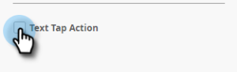

# Criar texto de mensagem no aplicativo {#create-in-app-message-text}

Clique na área de texto para trabalhar no estilo e no conteúdo do texto.

1. Clique no Texto principal para editar em linha.

   

1. Escolha a cor do texto clicando nela ou inserindo os números Hex ou RGB no seletor de cores.

   

1. Clique nas setas para selecionar um tamanho de texto.

   

   >[!CAUTION]
   >
   >Um tamanho de texto muito grande pode empurrar o conteúdo além de no máximo três linhas visíveis.

1. Escolha um estilo de tipo opcional, para ênfase: **Negrito**, _Itálico_ ou Sublinhado.

   

1. Escolha o alinhamento do texto: Esquerda, Centrada, Direita. Centralizado é o padrão.

   

   >[!NOTE]
   >
   >A fonte de texto que é renderizada no anúncio é a fonte padrão para cada plataforma: Helvetica para Apple e Roboto para Android

1. Marque a caixa para selecionar a ação Toque em texto .

   

1. Selecione a ação de toque para cada plataforma: Apple ou Android.

   

   >[!NOTE]
   >
   >Para ações de toque, você pode configurar ações diferentes para plataformas Apple e Android. Por exemplo, os deep links são tratados de forma diferente para Apple e Android. Se a mensagem for enviada apenas para uma plataforma ou para a outra, você pode deixar a outra na configuração padrão ou selecionar Nenhuma.

1. Clique em Texto de suporte para editá-lo em linha. Funciona da mesma forma que editar o texto Principal, mas o tamanho de texto padrão é menor.

   

1. Para o texto Principal ou Suporte, clique no ícone Token para adicionar um token.

   

1. Selecione Meu token no menu suspenso, adicione um valor padrão e clique em **Inserir**.

   

   >[!NOTE]
   >
   >Somente Meus tokens estão disponíveis como opções. Se nenhum My Tokens tiver sido configurado no programa, o menu suspenso Token ficará vazio.

   >[!TIP]
   >
   >Considere o comprimento dos caracteres que um token resolverá quando visualizado pelo seu público-alvo. Deixe espaço suficiente para contabilizar valores potencialmente mais longos, para evitar que sejam cortados.

   Quaisquer alterações feitas em tokens usados em um programa de mensagem no aplicativo aprovado não entrarão em vigor na mensagem no aplicativo até que o programa seja pausado e retomado.

Você está de ouro. Em seguida, você precisa [configurar o botão de mensagem no aplicativo](/help/marketo/product-docs/mobile-marketing/in-app-messages/creating-in-app-messages/set-up-the-in-app-message-button.md).

>[!MORELIKETHIS]
>
>* [Como entender as mensagens no aplicativo](/help/marketo/product-docs/mobile-marketing/in-app-messages/understanding-in-app-messages.md)
>* [Escolha um layout para a mensagem no aplicativo](/help/marketo/product-docs/mobile-marketing/in-app-messages/creating-in-app-messages/choose-a-layout-for-your-in-app-message.md)

