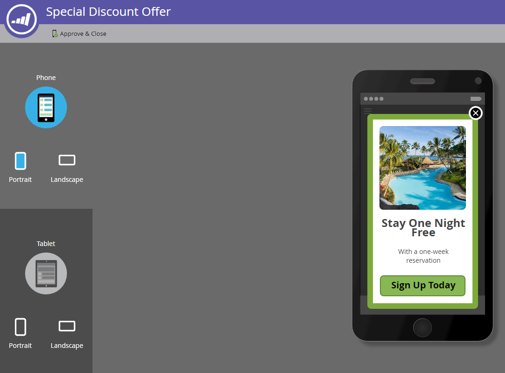

# Configurar o botão Dispensar e aprovar a mensagem {#set-up-the-dismiss-button-and-approve-the-message}

## Configurar Propriedades do Botão Dispensar  {#configure-dismiss-button-properties}

O botão Dispensar tem muitas opções que permitem configurá-lo da maneira que você desejar.

1. No editor, clique no botão Dispensar.

   

1. Se desejar alterar a cor do botão, clique no quadrado de seleção de cores. Selecione uma cor clicando nela ou digitando os números hexadecimais ou de RGB no seletor de cores. Preto é o padrão.

   

1. Selecione um design de botão no menu suspenso. Os botões redondos incluem uma opção de cor e gradiente.

   

   >[!CAUTION]
   >
   >A cor do botão pode ser exibida como um X branco em um fundo branco ao selecionar um design diferente no menu suspenso. Se sim, basta selecionar preto ou outra cor no quadrado de seleção de cores para tornar o X branco visível.

1. Você pode clicar no botão de canto esquerdo para mover o botão de descarte para a esquerda (o lado direito é o padrão).

   

1. Clique no menu suspenso de cada plataforma e selecione uma ação de toque para o botão Dispensar.

   

   >[!NOTE]
   >
   >Você deve dar ao botão Dispensar uma ação de toque, portanto, não há caixa de seleção para habilitá-lo. Ignorar mensagem é a opção padrão (e óbvia).

## Encerrar {#wrap-it-up}

Todas as seleções de gráficos, texto e botões foram salvas automaticamente. Agora, você está pronto para terminar o trabalho.

1. Para visualizar a mensagem no aplicativo, clique no menu suspenso **[!UICONTROL Ações de Mensagem]** e selecione **[!UICONTROL Visualizar]**.

   

1. Pré-visualize a mensagem no aplicativo por telefone ou tablet para garantir que ela seja exibida corretamente.

   

1. Se você estiver satisfeito com a mensagem no aplicativo, clique em **[!UICONTROL Aprovar e fechar]**.

   

   >[!NOTE]
   >
   >Você também pode selecionar **[!UICONTROL Aprovar e fechar]** diretamente no menu suspenso [!UICONTROL Ações de Mensagem] (veja a etapa 1), mas por que não visualizar a mensagem primeiro, apenas para ter segurança?

1. Para fechar o editor sem aprovação, basta fechar a guia. Ele é salvo automaticamente, para que você possa devolvê-lo e aprová-lo posteriormente.

   

Tantas escolhas, mas agora você tem uma mensagem no aplicativo de ótima aparência, pronta para ser enviada!

Agora é hora de [enviar sua mensagem](/help/marketo/product-docs/mobile-marketing/in-app-messages/sending-your-in-app-message/send-your-in-app-message.md).

>[!MORELIKETHIS]
>
>* [Noções Básicas Sobre Mensagens No Aplicativo](/help/marketo/product-docs/mobile-marketing/in-app-messages/understanding-in-app-messages.md)
>* [Escolha um layout para a mensagem no aplicativo](/help/marketo/product-docs/mobile-marketing/in-app-messages/creating-in-app-messages/choose-a-layout-for-your-in-app-message.md)
