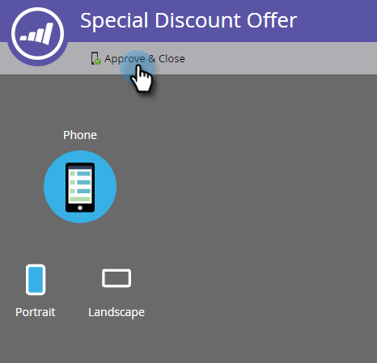

# Configure o botão Dismiss e aprove a mensagem {#set-up-the-dismiss-button-and-approve-the-message}

## Configurar propriedades do botão Dismiss  {#configure-dismiss-button-properties}

O botão Dismiss tem várias opções para permitir que você configure-o da maneira que desejar.

1. No editor, clique no botão Dismiss.

   

1. Se desejar alterar a cor do botão, clique no quadrado de seleção de cores. Selecione uma cor clicando nela ou digitando os números hexadecimais ou RGB no seletor de cores. Preto é o padrão.

   

1. Selecione um design de botão no menu suspenso. Botões redondos incluem uma cor completa e uma opção de gradiente.

   

   >[!CAUTION]
   >
   >A cor do botão pode ser exibida como um X branco em um plano de fundo branco quando você seleciona um design diferente do menu suspenso. Nesse caso, basta selecionar preto ou outra cor no quadrado de seleção de cores para tornar o X branco visível.

1. Você pode clicar no botão do canto esquerdo para mover o botão para a esquerda (o lado direito é o padrão).

   

1. Clique na lista suspensa para cada plataforma e selecione uma ação de toque para o botão Dismiss.

   

   >[!NOTE]
   >
   >Você deve dar ao botão Dismiss uma ação de toque, de modo que não há caixa de seleção para ativá-lo. Dismiss Message é a opção padrão (e óbvia).

## Envolva-o {#wrap-it-up}

Todas as suas seleções para gráficos, texto e botões foram salvas automaticamente. Agora, você está pronto para terminar o trabalho.

1. Para pré-visualização sua mensagem no aplicativo, clique no menu suspenso Ações **da** mensagem e selecione **Pré-visualização**.

   

1. Pré-visualização a mensagem no aplicativo no telefone ou no tablet para verificar se ela é exibida corretamente.

   

1. Se você estiver satisfeito com a mensagem no aplicativo, clique em **Aprovar e fechar**.

   

   >[!NOTE]
   >
   >Você também pode selecionar **Aprovar e fechar** diretamente no menu suspenso Ações da mensagem (consulte a etapa 1), mas por que não pré-visualização a mensagem primeiro, apenas para ser seguro?

1. Para fechar o editor sem aprovar, basta fechar a guia. Ele é salvo automaticamente, portanto, você pode retornar e aprová-lo mais tarde.

   

Tantas escolhas, mas agora você tem uma excelente mensagem no aplicativo, pronta para ir!

Agora é hora de [enviar sua mensagem](http://docs.marketo.com/display/docs/send+your+in-app+message).

>[!NOTE]
>
>**Artigos relacionados**
>
>* [Como entender as mensagens no aplicativo](../../../../product-docs/mobile-marketing/in-app-messages/understanding-in-app-messages.md)
>* [Enviar sua mensagem no aplicativo](http://docs.marketo.com/display/docs/send+your+in-app+message)
>* [Escolha um layout para sua mensagem no aplicativo](choose-a-layout-for-your-in-app-message.md)

>

