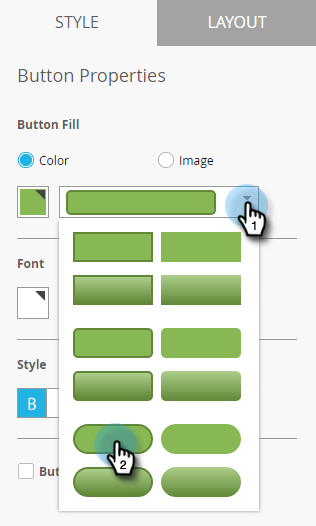

# Configurar o botão Mensagens no aplicativo {#set-up-the-in-app-message-button}

Você pode usar o design de botão padrão, modificá-lo ou carregar sua própria imagem de botão personalizada.

1. Clique no botão para abrir a guia Style para edição.

   

1. Para alterar a cor do botão padrão, clique no botão **Cor**.

   

1. Clique no quadrado da seleção de cores e selecione a cor do botão clicando nele ou inserindo os números hexadecimais ou de RGB no seletor de cores.

   

1. Selecione uma forma no menu suspenso. As opções de forma padrão incluem cantos nítidos, cantos redondos e gradientes.

   

1. Se quiser usar sua própria imagem para um botão, clique no botão Imagem e clique em **Selecionar Imagem**.

   

1. Escolha a imagem e clique em **Selecionar**.

   

   >[!TIP]
   >
   >Ao inserir uma imagem personalizada para o botão, considere limpar o texto do espaço reservado posicionado sobre ele se a imagem já incluir texto.

1. Clique no quadrado da seleção de cores e selecione a cor da fonte clicando nele ou digitando números hexadecimais ou de RGB no seletor de cores.

   

1. Clique nas setas para escolher o tamanho da fonte.

   

1. Escolha o estilo de fonte para ênfase: **Negrito**, _Itálico_ ou Sublinhado.

   

1. Clique no texto do botão para editá-lo em linha.

   

1. Marque a caixa para definir a ação de toque do botão.

   

1. Clique no menu suspenso de cada plataforma e selecione uma ação de toque.

   

   >[!NOTE]
   >
   >O botão sempre tem uma ação de toque, portanto, a caixa de seleção Toque em ação é selecionada automaticamente, com a mensagem padrão &quot;Ignorar mensagem&quot;.

Quase lá. A última etapa é [configurar o plano de fundo da mensagem no aplicativo e fechar o botão](/help/marketo/product-docs/mobile-marketing/in-app-messages/creating-in-app-messages/set-up-the-in-app-message-background.md).

>[!MORELIKETHIS]
>
>* [Noções Básicas Sobre Mensagens No Aplicativo](/help/marketo/product-docs/mobile-marketing/in-app-messages/understanding-in-app-messages.md)
>* [Escolha um layout para a mensagem no aplicativo](/help/marketo/product-docs/mobile-marketing/in-app-messages/creating-in-app-messages/choose-a-layout-for-your-in-app-message.md)
