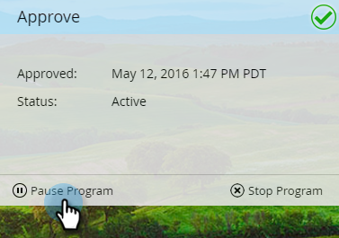

# Aprovar a mensagem no aplicativo {#approve-your-in-app-message}

Você precisa aprovar o envio antes que a mensagem no aplicativo seja enviada.

1. Se tudo estiver OK, clique em **[!UICONTROL Aprovar e Iniciar]**.

   

   >[!NOTE]
   >
   >Se qualquer parte do processo de envio estiver incompleta, por exemplo, a mensagem no aplicativo não for aprovada, uma mensagem de aviso será exibida, indicando qual área precisa de sua atenção. Corrija isso e você verá a mensagem na etapa 2.

1. Clique em **[!UICONTROL Aprovar e iniciar]**.

   

1. Se você usou campos personalizados, o Marketo pode levar mais tempo para ser executado e exibirá essa mensagem.

   

1. A mensagem agora está &quot;[!UICONTROL Ativa]&quot;.

   

   >[!NOTE]
   >
   >Normalmente, leva de 15 a 30 minutos para que uma mensagem no aplicativo aprovada fique visível para os visitantes em seu programa. Lembre-se, se você usou campos personalizados, pode levar várias horas ou mais.

   Você pode pausar ou parar um programa ativo, mas há uma grande diferença entre essas duas opções.

1. Clique em **[!UICONTROL Pausar Programa]** se precisar parar o programa por algum tempo, mas retomá-lo mais tarde. Ele mudará para o status **[!UICONTROL Pausado]**.

   

   >[!NOTE]
   >
   >Os motivos para a pausa podem ser apenas para pará-la por um tempo, ou se você quiser modificar a mensagem ou ajustar o agendamento. No entanto, não é possível alterar para uma mensagem diferente, apenas editar a existente.

1. Quando quiser que o programa pausado continue em execução, clique em **[!UICONTROL Retomar Programa]**.

   

1. Para parar o programa totalmente, clique em **[!UICONTROL Parar Programa]**.

   

1. Se tiver certeza de que deseja parar o programa, clique em **[!UICONTROL Parar]**.

   

   >[!NOTE]
   >
   >Quando você interrompe um programa, ele não é mais executado e não pode ser retomado. Se quiser executá-lo novamente, será necessário recriá-lo. Então, certifique-se de ter terminado um programa antes de clicar em **[!UICONTROL Parar programa]**!

## Painel no aplicativo {#in-app-dashboard}

Após a execução do programa, é possível monitorar o desempenho com o Painel no aplicativo, que é exibido automaticamente após a aprovação do programa. Para retornar ao programa, clique no link no canto superior direito e selecione **[!UICONTROL Painel de Controle]**.

Isso é tudo, pessoal!
