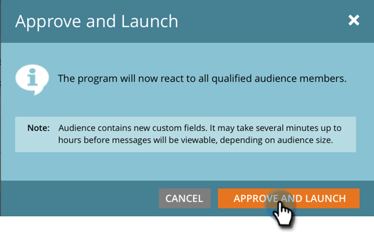

# Aprove sua mensagem no aplicativo {#approve-your-in-app-message}

Você precisa aprovar o envio antes que a mensagem no aplicativo seja enviada.

1. Se tudo parecer OK, clique em **Aprovar e Iniciar**.

   

   >[!NOTE]
   >
   >Se alguma parte do processo de envio estiver incompleta, por exemplo, a mensagem no aplicativo não estiver aprovada, uma mensagem de aviso será exibida, indicando qual área precisa de sua atenção. Corrija isso e você deverá ver a mensagem na etapa 2.

1. Clique em **Aprovar e Iniciar**.

   

1. Se você usou campos personalizados, o Marketo pode demorar mais para ser executado e exibirá essa mensagem.

   

1. A mensagem agora está ativa.

   

   >[!NOTE]
   >
   >Normalmente, demora de 15 a 30 minutos para que uma mensagem aprovada no aplicativo fique visível aos visitantes no seu programa. Lembre-se, se você usou campos personalizados, isso pode levar várias horas ou mais.

   Você pode pausar ou parar um programa ativo, mas há uma grande diferença entre essas duas opções.

1. Clique em **Pausar Programa** se precisar parar o programa por um tempo, mas retome-o mais tarde. Ele mudará para o status **Pausado**.

   

   >[!NOTE]
   >
   >Os motivos para pausar podem ser apenas para pará-la por algum tempo, ou se você quiser modificar a mensagem ou ajustar o agendamento. No entanto, você não pode mudar para uma mensagem diferente, apenas editar a existente.

1. Quando quiser que o programa pausado continue em execução, clique em **Resume** **Programa**.

   

1. Para interromper o programa completamente, clique em **Parar Programa**.

   

1. Se tiver certeza de que deseja parar o programa, clique em **Parar**.

   ** 

   **

   >[!NOTE]
   >
   >Quando você interrompe um programa, ele não é mais executado e não pode ser retomado. Se quiser executá-lo novamente, você terá que reconstruí-lo. Portanto, certifique-se de concluir o programa antes de clicar em **Parar Programa**!

## Painel no aplicativo {#in-app-dashboard}

Após a execução do programa, você pode monitorar o desempenho com o Painel no aplicativo, que é exibido automaticamente após a aprovação do programa. Para voltar ao programa, clique no link no canto superior direito e selecione **Painel de controle do Campaign**.

Isso é tudo, pessoal!

