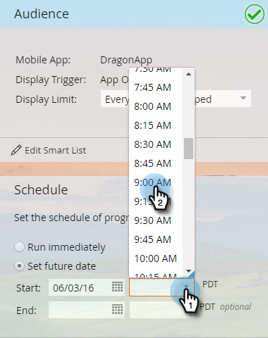

# Agendar mensagem no aplicativo {#schedule-your-in-app-message}

Envie sua mensagem agora ou agende para depois.

1. Para agendar uma mensagem no aplicativo, selecione **[!UICONTROL Definir data futura]** e escolha uma data de início no calendário suspenso.

   

1. Selecione uma hora de início no menu suspenso.

   

1. A Data e a hora de término são opcionais; selecione-as nos menus suspensos.

   

1. Ou, para executar o programa agora, selecione **[!UICONTROL Executar imediatamente]**. Os campos Data inicial desaparecem.

   

Calma! Por último, mas não menos importante, está a etapa [Aprovação](/help/marketo/product-docs/mobile-marketing/in-app-messages/sending-your-in-app-message/approve-your-in-app-message.md).
