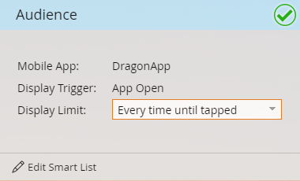

# Definir o público-alvo da mensagem no aplicativo {#set-your-in-app-message-audience}

O primeiro passo é decidir quem deve receber a mensagem no aplicativo. Você precisa configurar sua lista inteligente.

1. Clique em **[!UICONTROL Editar lista inteligente]**.

   

1. Na Smart List, o gatilho **[!UICONTROL Tem Atividade de Aplicativo Móvel]** é preenchido automaticamente. Clique na lista suspensa e selecione o aplicativo em que deseja colocar a mensagem.

   

   >[!NOTE]
   >
   >Vários valores para o campo Aplicativo móvel não são compatíveis atualmente com programas de mensagem no aplicativo.

1. **[!UICONTROL Abertura de Aplicativo]** é a configuração padrão de Ação, mas você pode selecionar qualquer evento personalizado que já tenha configurado.

   

   >[!NOTE]
   >
   >O acionador padrão ([!UICONTROL Aberto pelo Aplicativo]) e qualquer acionador personalizado adicionado ao código pelo desenvolvedor são automaticamente mostrados no seletor [!UICONTROL Ação]. Se um evento personalizado estiver ausente, verifique com o desenvolvedor para garantir que ele adicionou os eventos personalizados ao aplicativo. Esteja ciente de que o processo de codificação e aprovação do evento personalizado pode levar algum tempo para ser concluído. Consulte [este artigo](/help/marketo/product-docs/mobile-marketing/admin/before-you-create-push-notifications-and-in-app-messages.md) para obter mais informações.

1. Se necessário, há restrições disponíveis para o acionador **[!UICONTROL Tem atividade de aplicativo móvel]**.

   

1. É possível adicionar filtros à lista inteligente para limitar quem recebe a mensagem no aplicativo. Neste exemplo, usando o filtro **[!UICONTROL Data de aquisição]**, somente as pessoas adquiridas em 9 de junho de 2016 receberão a mensagem no aplicativo.

   

1. Retorne ao Painel de controle da mensagem no aplicativo. Defina o limite de exibição no menu suspenso.

   

   >[!NOTE]
   >
   >O limite de exibição padrão é **[!UICONTROL Uma vez por sessão]**. Se quiser que a mensagem pare de ser exibida depois que o destinatário responder, selecione **[!UICONTROL Toda vez até tocar]**. Se precisar ser exibido todas as vezes, não importa o que o destinatário faça, escolha **[!UICONTROL A cada vez]**.

   

Bom trabalho! Você definiu seu público-alvo. Você ganhou a barra azul e a marca verde.

Hora de [selecionar sua mensagem no aplicativo](/help/marketo/product-docs/mobile-marketing/in-app-messages/sending-your-in-app-message/select-your-in-app-message.md)!
