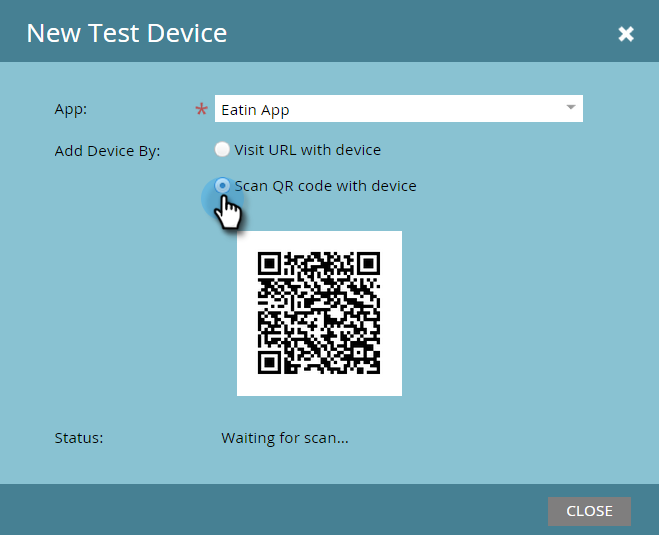
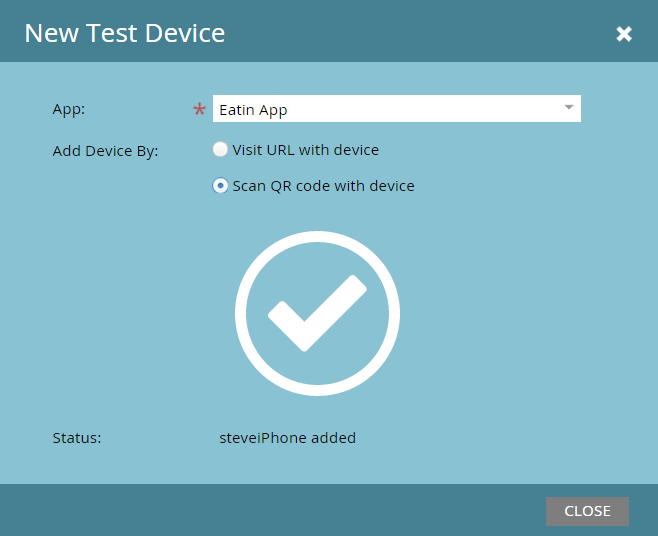

# Adicionando um novo dispositivo de teste {#adding-a-new-test-device}

É fácil adicionar um novo dispositivo de teste para enviar notificações.

>[!NOTE]
>
>**Permissões de administrador necessárias**

1. Clique em **[!UICONTROL Admin]** e depois no link **[!UICONTROL Aplicativos para dispositivos móveis]**.

   

1. Clique na guia **[!UICONTROL Dispositivos de Teste]** e **[!UICONTROL Novo Dispositivo de Teste]**.

   

1. Selecione seu aplicativo.

   

1. Você tem duas maneiras de conectar seu dispositivo ao aplicativo.

   Com a primeira opção, basta copiar o URL do campo e enviá-lo em um email ou mensagem de texto para o seu dispositivo. No dispositivo, toque no URL.

   

   Ou, com a segunda opção, clique no segundo botão e digitalize o código QR com seu dispositivo.

   

1. O aplicativo abre. Nomeie o dispositivo e toque em **[!UICONTROL Sim]**.

   

   Sucesso!

   

1. As Atualizações de status para mostrar o dispositivo são adicionadas. Parabéns!

   
