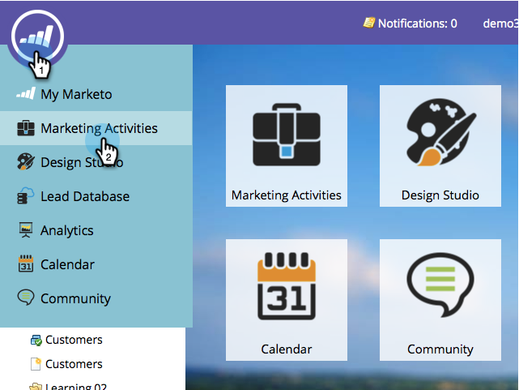
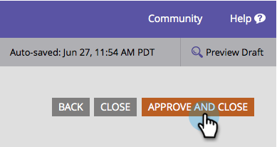

# Configurar notificação por push para dispositivos móveis {#configure-mobile-push-notification}

1. Vá para a **Atividades de marketing** área.

1. Selecione o ativo de push e clique em **Editar rascunho**.

   

1. Ir para **Configuração**.

   

1. Selecione o aplicativo desejado. As plataformas Android e Apple são ativadas por padrão.

   

1. Se a sua mensagem por push se aplicar a apenas uma plataforma (por exemplo, casos para iPhones), você poderá excluir a outra plataforma deslizando seu seletor para Desativado.

   

1. Clique em **Próxima**.

   

1. Insira o texto da mensagem ou selecione o ícone de token para adicionar tokens. Em seguida, selecione um **Toque em Ação**.

   

   >[!NOTE]
   >
   >Se uma plataforma estiver ativada, ela aparecerá no lado esquerdo da tela do telefone. Ele é exibido em cor quando é selecionado.

   >[!NOTE]
   >
   >Há três tipos de ações de toque:
   >
   >**Iniciar aplicativo** - **Este aplicativo** abre a página inicial do aplicativo quando a notificação é tocada. **Personalizado** O usa um deep link para abrir outras áreas do aplicativo ou qualquer outro aplicativo para o qual você tenha o link (consulte [URIs de deep link](#Deeplink) abaixo para obter detalhes).
   >
   >**Landing Page** - leva você a uma página de aterrissagem do Marketo especificada.
   >
   >**URL externo** - leva você a uma página de aterrissagem que não seja da Marketo.

1. Para inserir um deep link para uma ação de toque personalizada, clique em Personalizado e insira o [URI do deep link](#Deeplink) no campo.

   

1. Para inserir tokens, selecione um token, insira um valor padrão e clique em Insert.

   >[!NOTE]
   >
   >Os tokens são exibidos onde você coloca o cursor na caixa de texto. Você pode usar mais de um token.

   

   >[!NOTE]
   >
   >As mensagens e as ações de toque serão iguais em ambas as plataformas.

1. Somente para o iOS, marque a caixa de seleção para informar ao aplicativo para reproduzir um som quando a mensagem chegar. O Android reproduz o som automaticamente.

   

1. Visualize a outra plataforma e clique em **Concluir**.

   

1. Clique em **Aprovar e fechar**.

   

Parabéns! Agora, a notificação por push está pronta para ser enviada.

## URIs de deep link {#deep-link-uris}

Quando os assinantes clicam em um botão em uma mensagem por push, ele pode levá-los para a página inicial do seu aplicativo ou diretamente para uma página específica no aplicativo. Um deep link é uma referência exclusiva a uma página específica no seu aplicativo e se parece muito com um link de site.

Um URI de deep link é composto de três partes: nome do esquema, caminho e identificador. No exemplo abaixo, &quot;myappname&quot; é o schema. &quot;products&quot; é o caminho e &quot;purple-shirt&quot; é o identificador. Quando o cliente toca, ele é direcionado especificamente para o item de camisa roxa nas páginas de produto do aplicativo.

Dito isso, a estrutura de deep link do seu aplicativo pode ser diferente do exemplo acima. Seu desenvolvedor tem muitas opções para definir URIs de deep link. Portanto, peça ao desenvolvedor para enviar os URIs (links) para as páginas que você está interessado em usar. Isso garantirá que os URIs inseridos nas mensagens de push apontem para os locais corretos. Seu desenvolvedor pode [encontre mais informações aqui](https://experienceleague.adobe.com/en/docs/marketo-developer/marketo/mobile/enabling-deep-links-in-your-app).

>[!MORELIKETHIS]
>
>[Enviar uma notificação por push em dispositivo móvel](/help/marketo/product-docs/mobile-marketing/push-notifications/send-a-mobile-push-notification.md)
