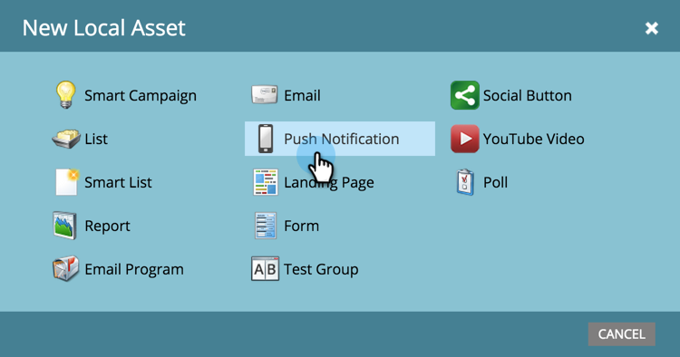

# Criar uma notificação por push {#create-a-push-notification}

É fácil criar uma notificação por push. No entanto, antes de começar, você deve ter o administrador do Marketo e o desenvolvedor de aplicativos móveis configurados para fazer o que for necessário. Consulte [Noções básicas sobre notificações por push](/help/marketo/product-docs/mobile-marketing/push-notifications/understanding-push-notifications.md) para obter detalhes.

1. Acesse a área **[!UICONTROL Atividades de marketing]**.

   

1. Localize e selecione seu programa.

   

1. Em **[!UICONTROL Novo]**, clique em **[!UICONTROL Novo ativo local]**.

   

1. Selecione **[!UICONTROL Notificação por push]**.

   

1. Insira um **Nome da Notificação por Push** e clique em **[!UICONTROL Criar]**.

   

   Doce! Agora que a notificação por push foi criada, vamos [vesti-la](/help/marketo/product-docs/mobile-marketing/push-notifications/configure-mobile-push-notification.md).
