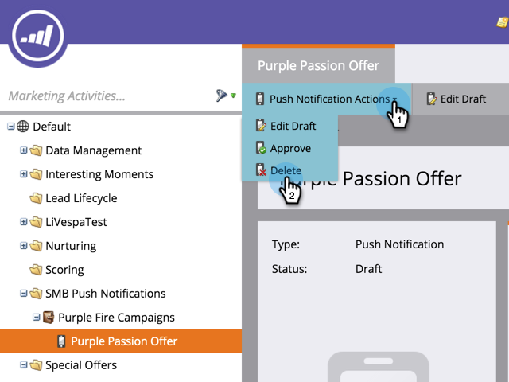

# Excluir notificação por push para celular {#delete-mobile-push-notification}

1. Vá para a área **Atividades de marketing**.

1. Localize e selecione sua notificação por push móvel.

   

1. Em **Ações de notificação por push**, clique em **Excluir**.

   

1. Confirme clicando em **Excluir**.

   

   >[!NOTE]
   >
   >Se a Notificação por push de dispositivos móveis estiver sendo usada por outros ativos, você não poderá excluí-la. Você precisa removê-lo dos ativos.
