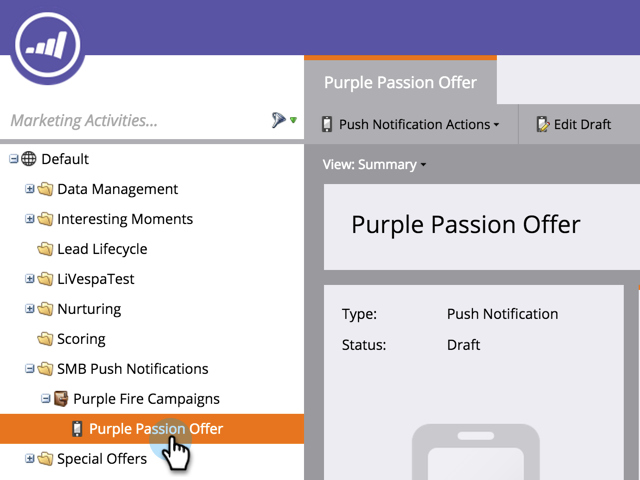

# Excluir notificação por push para celular {#delete-mobile-push-notification}

1. Acesse a área **[!UICONTROL Atividades de marketing]**.

1. Localize e selecione sua notificação por push móvel.

   

1. Em **[!UICONTROL Ações de notificação por push]**, clique em **[!UICONTROL Excluir]**.

   

1. Confirme clicando em **[!UICONTROL Excluir]**.

   

   >[!NOTE]
   >
   >Se a Notificação por push de dispositivos móveis estiver sendo usada por outros ativos, você não poderá excluí-la. Você precisa removê-lo dos ativos.
