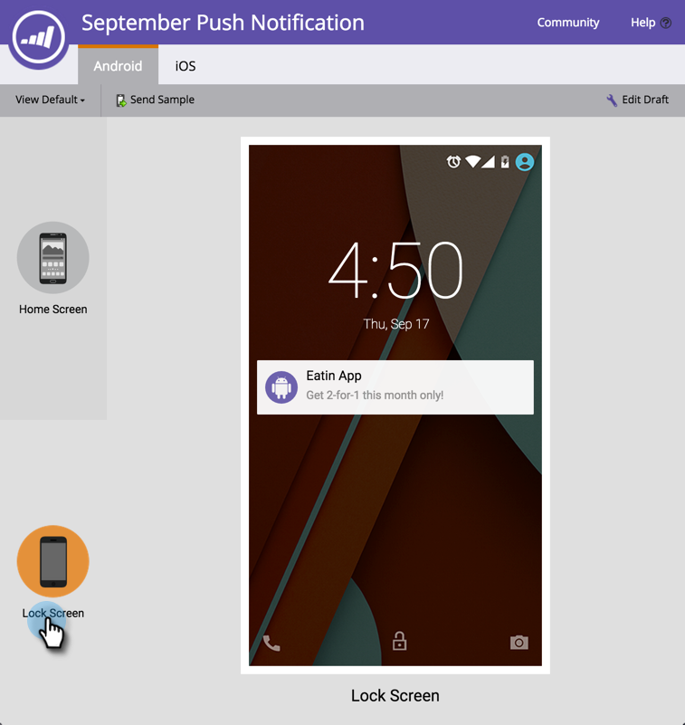

# Visualizar uma notificação por push {#preview-a-push-notification}

É fácil visualizar como a notificação por push será exibida para o Android ou para o iOS. Há quatro maneiras de fazer isso.

Na árvore de navegação, clique com o botão direito do mouse no arquivo da notificação que deseja visualizar e clique em **Visualizar**.

>[!NOTE]
>
>Se a notificação por push estiver ativada somente para uma plataforma, a guia da outra plataforma não será exibida.

Ou, na página de exibição Notificação por push, clique em **Ações de Notificação por Push** e depois em **Visualizar**. Ou clique em **Visualizar** na extremidade direita.

Por fim, no editor, você pode clicar na guia **Visualizar Rascunho**, no canto superior direito, enquanto trabalha na notificação.

## Visualizações do Android {#android-previews}

Clique no ícone à esquerda para ver exatamente onde a notificação por push será exibida ao enviá-la. Clique ou use as setas do teclado para alternar entre elas.

Na tela inicial, a notificação aparece um pouco abaixo da parte superior, abaixo dos ícones.

Na tela de Bloqueio, ele aparece parcialmente para baixo, por baixo do tempo.

>[!NOTE]
>
>Não há uma exibição da Central de notificações no Android.

## Visualizações do iOS {#ios-previews}

Assim como no Android, clique ou use as setas do teclado para alternar entre as exibições.

Na tela Início, a notificação é exibida na parte superior.

Na tela Lock (Bloqueio), ele aparece parcialmente para baixo.

Na tela da Central de notificações, perto da parte superior,

Assim, com a pré-visualização de notificação por push, você sempre sabe o que seus clientes verão!

>[!MORELIKETHIS]
>
>* [Criar uma Notificação por Push](/help/marketo/product-docs/mobile-marketing/push-notifications/create-a-push-notification.md)
>* [Configurar notificação por push para dispositivos móveis](/help/marketo/product-docs/mobile-marketing/push-notifications/configure-mobile-push-notification.md)
