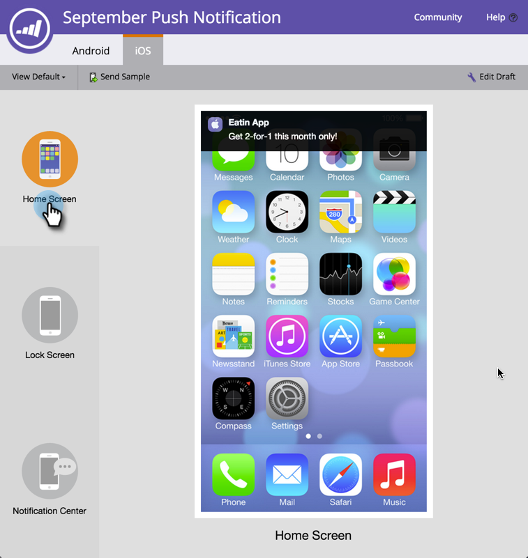

# Pré-visualização de uma notificação por push {#preview-a-push-notification}

É fácil pré-visualização como será a sua notificação por push, para Android ou iOS. Há quatro maneiras de fazer isso.

Na árvore de navegação, clique com o botão direito do mouse no arquivo para a notificação que deseja pré-visualização e clique em **Pré-visualização**.

>[!NOTE]
>
>Se a notificação por push estiver ativada para apenas uma plataforma, a guia para a outra não será exibida.

Ou, na página visualização de notificação por push, clique em **Ações de notificações por push** e **Pré-visualização**. Ou clique em **Pré-visualização **na extremidade direita.** **

Finalmente, no editor, você pode clicar na guia **Rascunho de Pré-visualização** no canto superior direito enquanto trabalha na notificação.

## Android Pré-visualização {#android-previews}

Clique no ícone à esquerda para ver exatamente onde a notificação por push será exibida ao enviá-la. Clique ou use as setas do teclado para alternar entre elas.

Na tela Início, a notificação é exibida um pouco abaixo da parte superior, abaixo dos ícones.

Na tela Lock (Bloquear), ela aparece parcialmente para baixo, sob o tempo.

>[!NOTE]
>
>Não há uma visualização do Notification Center no Android.

## iOS Pré-visualização {#ios-previews}

Assim como no Android, clique ou use setas do teclado para alternar entre o visualização.

Na tela Início, a notificação é exibida na parte superior.

Na tela Lock (Bloquear), ela é exibida em parte para baixo.

Na tela Central de Notificações, fica perto do topo.

Assim, com a pré-visualização de notificação por push, você sempre sabe o que seus clientes verão!

>[!MORELIKETHIS]
>
>* [Criar uma notificação por push](create-a-push-notification.md)
>* [Configurar notificação por push móvel](configure-mobile-push-notification.md)

>

