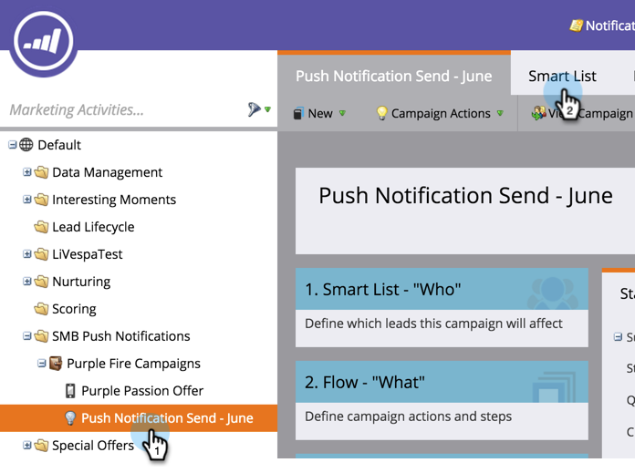

# Enviar uma notificação por push móvel {#send-a-mobile-push-notification}

Envie uma notificação por push para as pessoas que usam seu aplicativo móvel.

>[!PREREQUISITES]
>
>* [Criar uma nova Campanha inteligente](../../../product-docs/core-marketo-concepts/smart-campaigns/creating-a-smart-campaign/create-a-new-smart-campaign.md)
>* [Criar uma notificação por push](create-a-push-notification.md)

>

1. Vá para a área **Marketing Atividade** .

   

1. Selecione sua campanha inteligente e clique em Lista **inteligente**.

   

1. Defina sua lista inteligente e clique em **FLUXO.**

   

1. Selecione uma notificação por push. Clique em **Agendamento**

   

   >[!NOTE]
   >
   >A notificação por push deve ser aprovada antes de ser exibida no menu suspenso.

1. Clique em **Executar uma vez**

   

1. Escolha uma data e hora. Clique em **SALVAR.**

   

Sente-se e aguarde a notificação por push ser enviada.