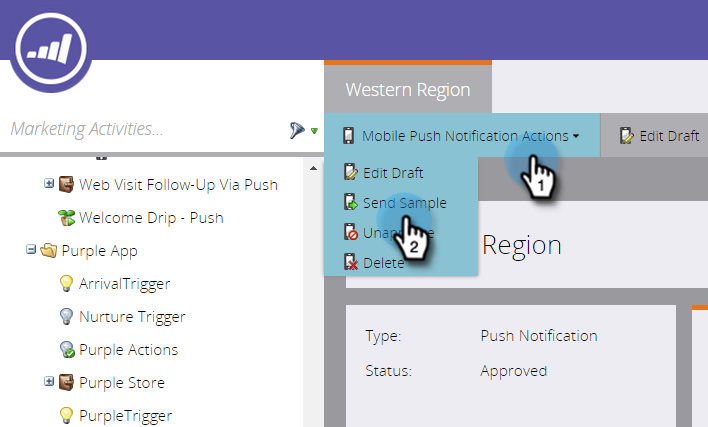
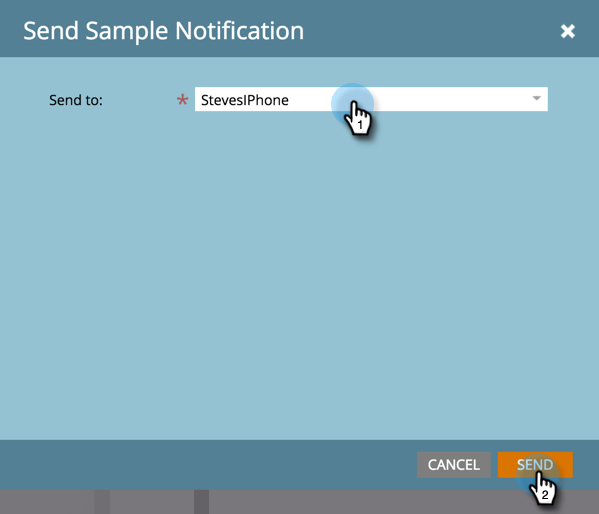

# Enviar uma amostra de notificação por push {#send-a-push-notification-sample}

Você pode enviar uma amostra para verificar se a sua notificação por push está funcionando corretamente!

>[!PREREQUISITES]
>
>Verifique se o aplicativo está instalado no dispositivo para o qual você está enviando a amostra.

1. Você pode enviar uma amostra de três maneiras:

   Na árvore à esquerda, clique com o botão direito no ativo de notificação por push e clique em **Enviar amostra**.

   

   Ou, no menu de ações Notificação por push, clique em **Enviar amostra**.

   

   Ou, no Editor de Notificações por Push, clique em **Enviar Amostra**.

   

1. Se você já tiver configurado o dispositivo de teste que deseja usar, basta selecioná-lo na lista.

   

   Ou clique em **Adicionar Dispositivo** para [adicionar um novo dispositivo de teste](/help/marketo/product-docs/mobile-marketing/push-notifications/adding-a-new-test-device.md) para enviar a amostra para.

   

1. Você tem duas maneiras de conectar seu dispositivo ao aplicativo.

   Com a primeira opção, clique no botão **Visitar URL com dispositivo**, copie a URL do campo e envie-a por email ou mensagem de texto para o seu dispositivo. No dispositivo, toque no URL. Quando o status mostrar a conexão, clique em **Enviar**.

   

   Ou, com a segunda opção, clique no botão **Digitalizar código QR com dispositivo** e digitalize o Código QR com seu dispositivo. Quando o status mostrar a conexão, clique em **Enviar**.

   

   >[!TIP]
   >
   >Você adicionou com êxito um dispositivo de teste, mas não o vê listado no campo **Enviar para**? Marque estas opções para solucionar problemas:
   >
   >* As notificações por push estão ativadas para o aplicativo associado à notificação por push.
   >
   >* A notificação por push está configurada para a plataforma do dispositivo de teste. Por exemplo, se você acabou de adicionar um iPhone como dispositivo de teste, verifique se a notificação por push está ativada para o iOS.

Calma!
