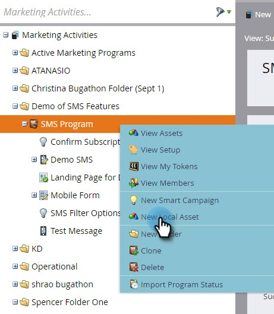
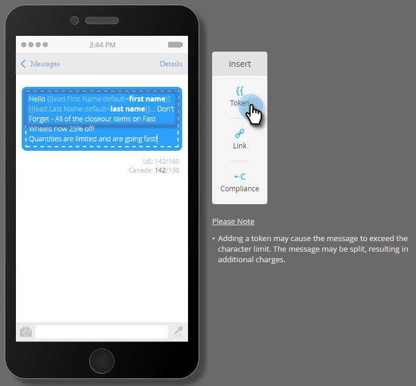

# Criar uma mensagem SMS do Vibes {#create-a-vibes-sms-message}

Veja como criar uma mensagem SMS do Vibes.

>[!AVAILABILITY]
>
>Esse recurso está disponível como um complemento para sua conta da Adobe Marketo Engage. Para ser provisionado adequadamente, ele deve ser adquirido por meio do Adobe. Entre em contato com a equipe de conta do Adobe (seu gerente de conta) para obter mais detalhes.

1. Ir para **Atividades de marketing**.

   

1. Clique com o botão direito em um programa e selecione **Novo ativo local**.

   

1. Clique em **Novo ativo local**.

   

   >[!TIP]
   >
   >Como alternativa, você pode clicar na guia **Novo** menu suspenso.

1. Clique em **Mensagem SMS**.

   

1. Insira um nome e uma descrição opcional para a nova mensagem SMS e clique em **Criar**.

   

1. Clique em **Editar rascunho**.

   

1. No editor de mensagens, clique dentro da bolha azul e comece a inserir texto.

   

   >[!NOTE]
   >
   >O limite de caracteres para uma mensagem SMS é de 160 caracteres usando o conjunto de caracteres ASCII padrão. Se exceder 160 caracteres, sua mensagem será dividida com base na contagem total de caracteres.

1. Clique em **Token** no menu Inserir para adicionar um token à mensagem.

   

   >[!NOTE]
   >
   >O acréscimo de um token pode fazer a mensagem exceder o limite de caracteres. A mensagem então será dividida, resultando em mensagens adicionais.

   >[!IMPORTANT]
   >
   >Conformidade com SMS: todas as mensagens SMS de saída devem incluir o Nome da marca ou a Descrição do programa. As instruções HELP e STOP devem ser fornecidas pelo menos uma vez por mês por assinante para programas de mensagem recorrentes.

   ????? Usar o encurtador de URL do Marketo resultará no uso de X caracteres na mensagem ?????

1. Clique em **Link** no menu Inserir para adicionar um link à mensagem.

   

1. Selecione um tipo de link. Página de aterrissagem do Marketo é o padrão. Se você for com isso, será necessário selecionar a landing page no menu suspenso e clicar em **Inserir**.

   

   >[!NOTE]
   >
   >* Os dois links de rastreamento são selecionados por padrão.
   >* Usar o encurtador de URL do Marketo resultará no uso de X caracteres na mensagem.?????????????????

1. Se, em vez disso, você quiser usar um URL externo, clique no link **URL externo** e insira o URL no campo URL. Clique em **Inserir**.

   

   >[!CAUTION]
   >
   >Recomenda-se _não_ use encurtadores de URL (por exemplo, Bitly), já que as operadoras podem sinalizar sua mensagem como spam.

1. O link é exibido na mensagem.

   

   >[!NOTE]
   >
   >O Marketo exibe uma pré-visualização de link do domínio de rastreamento com marca. Se você desmarcar a caixa de seleção de link mkt_tok, o link será alterado. Desmarque a caixa de seleção Rastrear link também e o URL será encurtado para seu comprimento básico (por exemplo, www.mygooglepage.com).

   

   >[!NOTE]
   >
   >A contagem de caracteres reflete somente os caracteres contidos na mensagem mais baixa.

Se você inserir mais do que o limite dos EUA, o editor quebrará a mensagem em seções. Há um limite total absoluto de 900 caracteres. Após atingir esse limite, a mensagem será truncada automaticamente quando enviada para o público-alvo.

LIMITE DE USO???????
