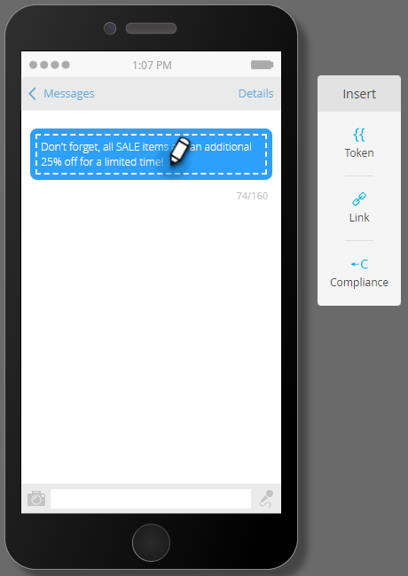

# Criar uma mensagem de SMS {#create-an-sms-message}

Veja como criar uma mensagem SMS.

>[!AVAILABILITY]
>
>Esse recurso está disponível como um complemento para sua conta da Adobe Marketo Engage. Para ser provisionado corretamente, ele deve ser adquirido por meio da Adobe. Entre em contato com a equipe de conta da Adobe (seu gerente de conta) para obter mais detalhes. A integração nativa de SMS do Marketo Vibes está disponível nos EUA e no Canadá. Para outros países, uma conexão via Webhooks do Marketo pode ser utilizada ao [contatar a Vibes diretamente](https://www.vibes.com/talk-to-sales).

>[!PREREQUISITES]
>
>[Adicionar Vibrações como um Serviço do LaunchPoint](/help/marketo/product-docs/mobile-marketing/admin/add-vibes-as-a-launchpoint-service.md){target="_blank"}

1. Vá para **[!UICONTROL Atividades de marketing]**.

   

1. Clique com o botão direito no programa desejado e selecione **[!UICONTROL Novo ativo local]**.

   

1. Selecione **Mensagem SMS**.

   

1. Insira um nome e uma descrição opcional para a nova mensagem SMS e clique em **Criar**.

   

1. No editor, clique dentro da bolha azul e comece a inserir texto.

   

   >[!NOTE]
   >
   >O limite de caracteres para uma mensagem SMS é de 160 caracteres usando o conjunto de caracteres ASCII padrão. Se exceder 160 caracteres, sua mensagem será dividida com base na contagem total de caracteres.

1. Para adicionar um token à mensagem, escreva uma saudação rápida e clique em **Token**.

   

   >[!NOTE]
   >
   >O acréscimo de um token pode fazer a mensagem exceder o limite de caracteres. A mensagem seria então dividida, criando uma mensagem adicional.

   >[!IMPORTANT]
   >
   >Conformidade com SMS: todas as mensagens SMS de saída devem incluir o Nome da marca ou a Descrição do programa. As instruções HELP e STOP devem ser fornecidas pelo menos uma vez por mês por assinante para programas de mensagem recorrentes.

1. Selecione o **Token** desejado, insira um **Valor Padrão** opcional e clique em **Criar**.

   

1. Para adicionar um link, selecione onde deseja que ele apareça na mensagem e clique em **Link**.

   

1. Selecione um tipo de link. Página de aterrissagem do Marketo é o padrão. Se você fizer isso, clique no menu suspenso Landing Page e selecione a página desejada. Clique em **Inserir** quando terminar.

   

   >[!NOTE]
   >
   >Os dois links de rastreamento são selecionados por padrão. Se você desmarcar Incluir mkt_tok, ainda permitirá que o link seja rastreado, mas após o redirecionamento, o URL de destino não incluirá o parâmetro da string de consulta mkt_tok. Esse parâmetro é usado pelas páginas de aterrissagem do Marketo e pelo Munchkin para garantir o rastreamento adequado das atividades das pessoas (como quando uma pessoa opta por não participar).

1. Se, em vez disso, você quiser usar uma URL externa, selecione **URL externa**, insira/cole a URL e clique em **Inserir**.

   

   >[!NOTE]
   >
   >Ao manter a opção &quot;Rastrear link&quot; selecionada, o Marketo modificará automaticamente o URL para fins de rastreamento. Se você optar por desabilitar o rastreamento, a URL será exibida na mensagem inalterada (por exemplo, `www.adobe.com`).

   >[!CAUTION]
   >
   >É recomendável _não_ usar encurtadores de URL (por exemplo, Bitly), já que as operadoras podem sinalizar sua mensagem como spam.

1. O link é exibido na mensagem.

   

   >[!NOTE]
   >
   >O Marketo exibe uma pré-visualização de link do domínio de rastreamento com marca. Se você desmarcar a caixa de seleção de link mkt_tok, o link será alterado.

Se você inserir mais de 160 caracteres, o editor quebrará o SMS em seções. Há um limite geral de 900 caracteres por mensagem. Se você exceder esse número, a mensagem será truncada no delivery.
