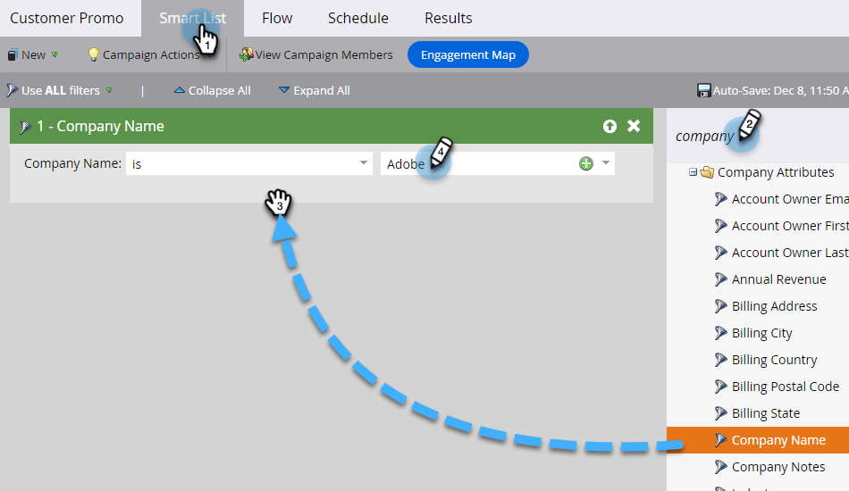

# Enviar uma mensagem SMS {#send-a-vibes-sms-message}

Você tem [criou sua mensagem SMS](/help/marketo/product-docs/mobile-marketing/vibes-sms-messages/create-an-sms-message.md){target="_blank"}, agora é hora de enviá-lo. Você pode enviá-lo por Lote ou Acionar a campanha.

>[!NOTE]
>
>Ao enviar mensagens SMS:
>
>* Desduplicação de Marketo Engage por número de telefone. Assim, se várias pessoas tiverem o mesmo número de telefone, somente uma pessoa receberá a mensagem se for membro de apenas uma lista de assinaturas Vibes. A desduplicação é feita no nível da lista de assinaturas Vibes, não no nível do programa Marketo.
>* O Marketo incluir na lista de bloqueios não enviará para as pessoas que estão aprovadas ou com suspensão de marketing.
>* Uma mensagem SMS não enviará a ninguém que tenha cancelado a assinatura se não estiver na lista do banco de dados móvel do Vibes.

## Enviar um SMS em lote {#send-a-batch-sms}

1. Em Meu Marketo, clique em **Atividades de marketing**.

   

1. Localize e selecione a Campanha inteligente desejada.

   

1. Clique em **Lista inteligente** e definir o público-alvo do SMS. Neste exemplo, estamos enviando para todos em nosso banco de dados que têm &quot;Adobe&quot; listado como sua empresa.

   

1. No **Fluxo** guia, arraste sobre **Enviar mensagem SMS**. Selecione a lista de mensagens e vibrações SMS desejada nos menus suspensos.

   

   >[!NOTE]
   >
   >O seletor da Lista de vibrações atua como um filtro adicional para o público-alvo já identificado na Lista inteligente para direcionar somente as pessoas que pertencem a essa lista de vibrações.

1. Clique em **Agendar** e agende seu SMS.

   

## Enviar um SMS de acionador {#send-a-trigger-sms}

1. Em Meu Marketo, clique em **Atividades de marketing**.

   

1. Localize e selecione a Campanha inteligente desejada.

   

1. Clique em **Lista inteligente** selecione o acionador desejado e defina seu valor. Neste exemplo, estamos usando **Preenche o formulário**.

   

1. No **Fluxo** guia, arraste sobre **Enviar mensagem SMS**. Selecione a lista de mensagens e vibrações SMS desejada nos menus suspensos.

   

   >[!NOTE]
   >
   >O seletor da Lista de vibrações atua como um filtro adicional para o público-alvo já identificado na Lista inteligente para direcionar somente as pessoas que pertencem a essa lista de vibrações.

1. Clique em **Agendar** , depois **Ativar**.

   

>[!MORELIKETHIS]
>
>* [Criar uma mensagem de vibrações](/help/marketo/product-docs/mobile-marketing/vibes-sms-messages/create-an-sms-message.md){target="_blank"}
>* [Utilização das opções de SMS em uma campanha inteligente](/help/marketo/product-docs/mobile-marketing/vibes-sms-messages/using-sms-options-in-a-smart-campaign.md){target="_blank"}
