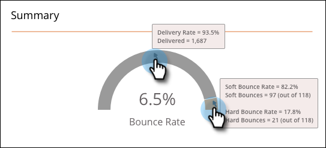
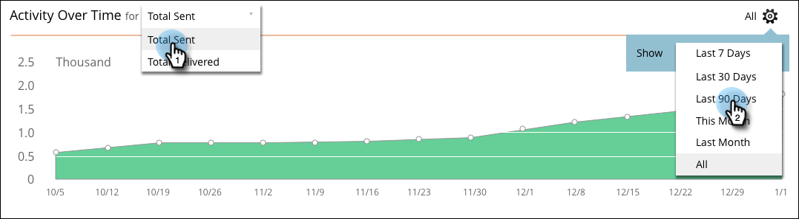

# Relatórios de SMS {#sms-reporting}

O Painel de mensagens SMS fornece análises úteis sobre suas mensagens.

## Acessar o painel {#access-the-dashboard}

1. Para exibir os relatórios, selecione a mensagem SMS desejada. Clique em **Exibir** e selecione **Painel**.

   

1. O painel será exibido.

   

## Visão geral do painel {#dashboard-overview}

### Crescimento de SMS {#sms-progression}

Exibe o total enviado e o total entregue. Os valores estão à direita e, se você passar o mouse sobre uma barra, a porcentagem será exibida.

### Resumo {#summary}

Mostra a Taxa de rejeição calculada como uma porcentagem. Passe o mouse sobre a barra de arqueamento para visualizar a taxa de entrega por valor e porcentagem. Passe o mouse sobre a seção Taxa de rejeição laranja da barra para visualizar os valores/porcentagens da Taxa de rejeição temporária e permanente.

### Atividade ao longo do tempo {#activity-over-time}

Permite que você selecione o Total Enviado ou o Total Entregue. Selecione um intervalo apropriado no seletor de intervalo de datas.

