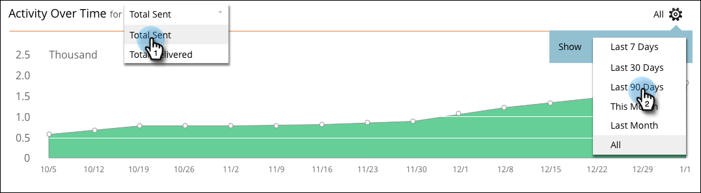

# O Painel de Mensagens SMS {#the-sms-message-dashboard}

O Painel de Mensagens SMS exibe informações úteis sobre sua mensagem SMS.

O gráfico **Progressão do SMS** exibe o total enviado e o total entregue. As quantias estão à direita e se você passar o mouse sobre uma barra, a porcentagem será exibida.

O gráfico **Resumo** mostra a Taxa de Rejeição calculada como uma porcentagem. Passe o cursor do mouse sobre a barra de arqueamento para visualização da taxa de delivery por quantidade e porcentagem. Passe o cursor do mouse sobre a seção Taxa de rejeição laranja da barra para visualização as quantias Taxa de rejeição suave e Taxa de rejeição sólida e as porcentagens.

O gráfico **Atividade ao longo do tempo** permite selecionar Total Enviado ou Total Entregue. Selecione um intervalo apropriado no seletor de intervalo de datas.

Limpe como um sino!
