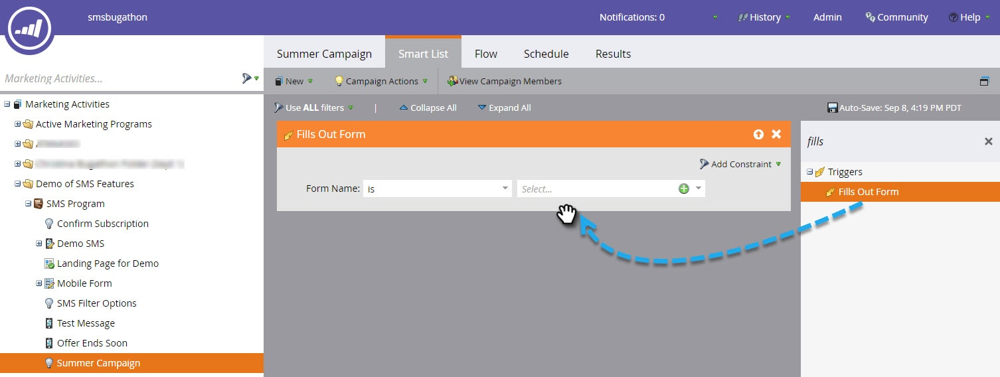
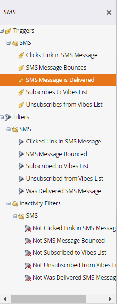

# Usar mensagens SMS de vibrações em acionadores e filtros de lista inteligente {#use-vibes-sms-messages-in-smart-list-triggers-and-filters}

Depois que você [criar uma mensagem SMS do Vibes](/help/marketo/product-docs/mobile-marketing/vibes-sms-messages/create-a-vibes-sms-message.md), você deverá usar acionadores e filtros de listas inteligentes em uma campanha inteligente para obter os benefícios. Veja como.

1. Em Meu Marketo, clique em **Atividades de marketing**.

   

1. Escolha uma campanha inteligente na qual você deseja usar seu ativo de SMS. Arraste sobre um acionador, como o **Preenche o formulário**.

   

## Acionadores de SMS {#sms-triggers}

Há outros acionadores de SMS disponíveis. Os acionadores de SMS são exibidos somente se o serviço Vibes estiver ativado.

Veja alguns exemplos:

O acionador Rejeições de mensagem SMS inicia um fluxo, como o envio de um email, quando uma mensagem SMS é rejeitada.

A variável **Inscreve-se na lista de vibrações** acionador inicia um fluxo quando uma pessoa se inscreve.

A variável **Link de cliques em mensagem SMS** O acionador inicia um fluxo quando uma pessoa clica em um link na mensagem SMS.

## Filtros de SMS {#sms-filters}

Você também pode usar filtros de Vibes em listas inteligentes. A variável **Inscrito na lista de vibrações** o filtro localiza qualquer pessoa que tenha *sempre* assinou o Vibes. Isso inclui pessoas canceladas e excluídas, mesmo que as pessoas excluídas sejam omitidas do fluxo. Esse filtro é mais adequado para relatórios.

Em contrapartida, a **Membro da lista de vibrações** o filtro localiza _qualquer pessoa_ no momento, está inscrito nas Vibes e é mais adequado para uso em campanhas ou listas inteligentes.

>[!NOTE]
>
>Todos os filtros SMS incluem o **Data da atividade** restrição por padrão.

Depois de configurar acionadores e filtros de Vibes na lista inteligente, você pode [definir o fluxo](/help/marketo/product-docs/mobile-marketing/vibes-sms-messages/add-a-flow-step-for-sms.md).

>[!MORELIKETHIS]
>
>* [Definir lista inteligente para o Smart Campaign | Acionador](/help/marketo/product-docs/core-marketo-concepts/smart-campaigns/creating-a-smart-campaign/define-smart-list-for-smart-campaign-trigger.md)
>* [Localizar e adicionar filtros a uma lista inteligente](/help/marketo/product-docs/core-marketo-concepts/smart-lists-and-static-lists/creating-a-smart-list/find-and-add-filters-to-a-smart-list.md)
