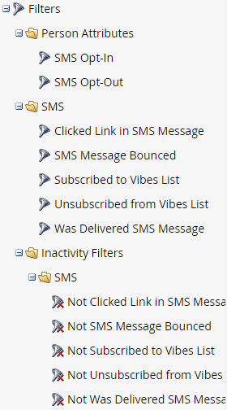

# Utilização das opções de SMS em uma campanha inteligente {#using-sms-options-in-a-smart-campaign}

Depois de [criar uma mensagem SMS](/help/marketo/product-docs/mobile-marketing/vibes-sms-messages/create-an-sms-message.md){target="_blank"}, você deverá usar os disparadores e filtros da Smart List em uma Campanha Inteligente para obter os benefícios.

>[!NOTE]
>
>Se você deseja enviar uma mensagem SMS, temos um [artigo específico](/help/marketo/product-docs/mobile-marketing/vibes-sms-messages/send-an-sms-message.md){target="_blank"} para isso.

>[!PREREQUISITES]
>
>Os disparadores/filtros de SMS só aparecerão se o [serviço de Visualizações tiver sido habilitado](/help/marketo/product-docs/mobile-marketing/admin/add-vibes-as-a-launchpoint-service.md){target="_blank"}.

## Acionadores de SMS {#sms-triggers}

<table style="width:600px">
  <tr>
    <td style="width:50%"></td>
    <td style="width:50%"></td>
  </tr>
</table>

Veja alguns exemplos:

O gatilho **Rejeições de Mensagens SMS** inicia um fluxo, como o envio de um email, quando uma mensagem SMS é rejeitada.

O gatilho **Inscreve-se na Lista de Vibrações** inicia um fluxo quando uma pessoa se inscreve.

O acionador **Link de Cliques na Mensagem SMS** inicia um fluxo quando uma pessoa clica em um link na mensagem SMS.

## Filtros de SMS {#sms-filters}

<table style="width:600px">
  <tr>
    <td style="width:50%"></td>
    <td style="width:50%"></td>
  </tr>
</table>

O filtro **Inscrito na Lista de Vibrações** encontra qualquer pessoa que *já* tenha inscrito nas Vibes. Isso inclui pessoas canceladas e excluídas, mesmo que as pessoas excluídas sejam omitidas do fluxo. Esse filtro é mais adequado para relatórios.

Por outro lado, o filtro **Membro da Lista de Vibrações** encontra *qualquer pessoa* inscrita atualmente nas Vibes e é mais adequado para uso em Campanhas ou listas inteligentes.

>[!NOTE]
>
>Todos os filtros SMS incluem a restrição **Data de Atividade** por padrão.

## Etapas de fluxo de SMS {#sms-flow-steps}

Há três etapas de fluxo de SMS para escolher.

<table>
<tbody>
  <tr>
    <td style="width:20%"><b>Enviar mensagem de SMS</b></td>
    <td>Essa ação de fluxo envia mensagens para pessoas da Smart List do Marketo que estão inscritas em uma lista de inscrição de vibrações de opt-in do usuário. Ele não inicia o processo de assinatura. <a href="/help/marketo/product-docs/mobile-marketing/vibes-sms-messages/send-an-sms-message.md">Saiba mais</a>.</td>
  </tr>

<tr>
    <td style="width:20%"><b>Assinar a lista do Vibes</b></td>
    <td>Essa ação de fluxo inicia o processo de assinatura do SMS por meio de uma campanha de aquisição de Vibes selecionada pelo usuário. A Vibes envia uma mensagem de confirmação, e o recipient deve responder com "Y" dentro de 24 horas para confirmar a aceitação. Depois que o usuário aceitar, ele se tornará membro da lista de inscrição do Vibes associada.</td>
  </tr>
  <tr>
    <td style="width:20%"><b>Cancelar assinatura da lista do Vibes</b></td>
    <td>Essa ação de fluxo cancela a assinatura de cada pessoa em uma lista de assinaturas de Vibes de opt-in do usuário. Quando um usuário envia um texto "PARAR" para o seu código, o registro pessoal dele é atualizado para refletir que não é mais membro da lista de assinaturas do Vibes.</td>
  </tr>
  </tbody>
</table>

>[!NOTE]
>
>Os fluxos **Assinar a Lista de Vibes** e **Cancelar Assinatura da Lista de Vibes** têm requisitos diferentes. Para **Assinar**, você deve selecionar a lista de Vibes e a campanha de aquisição de Vibes. Para **Cancelar inscrição**, somente a lista de Vibes é necessária.

>[!MORELIKETHIS]
>
>* [Enviar uma Mensagem SMS](/help/marketo/product-docs/mobile-marketing/vibes-sms-messages/send-an-sms-message.md){target="_blank"}
>* [Definir lista inteligente para campanha inteligente | Acionador](/help/marketo/product-docs/core-marketo-concepts/smart-campaigns/creating-a-smart-campaign/define-smart-list-for-smart-campaign-trigger.md){target="_blank"}
>* [Definir lista inteligente para campanha inteligente | Lote](/help/marketo/product-docs/core-marketo-concepts/smart-campaigns/creating-a-smart-campaign/define-smart-list-for-smart-campaign-batch.md){target="_blank"}
