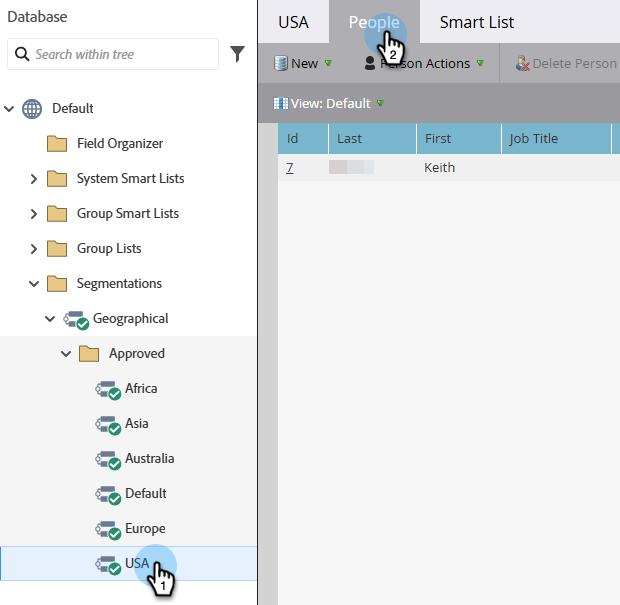

# Aprovar uma segmentação {#approve-a-segmentation}

Uma segmentação precisa ser aprovada antes de ser usada.

>[!PREREQUISITES]
>
>* [Criar uma segmentação](/help/marketo/product-docs/personalization/segmentation-and-snippets/segmentation/create-a-segmentation.md)
>* [Definir Regras de Segmento](/help/marketo/product-docs/personalization/segmentation-and-snippets/segmentation/define-segment-rules.md)

>[!NOTE]
>
>Um máximo de 20 segmentações podem ser aprovadas de cada vez.

1. Vá para o **[!UICONTROL Banco de Dados]**.

   

1. Na segmentação, clique em **[!UICONTROL Ações de segmentação]** e depois em **[!UICONTROL Aprovar]**.

   

   >[!NOTE]
   >
   >O status muda para _Aprovando_ enquanto a aprovação está em andamento.

   >[!CAUTION]
   >
   >A aprovação pode levar de alguns minutos a um ou dois dias para ser concluída, dependendo do tamanho do banco de dados.

1. Depois de aprovado, o [!UICONTROL Status] muda de [!UICONTROL Aprovando] para [!UICONTROL Aprovado].

   

   >[!TIP]
   >
   >O número de pessoas em cada segmento é mostrado entre parênteses ao lado do nome do segmento.

1. A guia **[!UICONTROL Pessoas]** no **[!UICONTROL Segmento]** agora mostra a lista final de pessoas para o segmento.

   

>[!CAUTION]
>
>O número total de segmentos que você pode criar em uma segmentação depende do número e do tipo de filtros usados e também da complexidade da lógica dos seus segmentos. Embora você possa criar até 100 segmentos usando campos padrão, usar outros tipos de filtros pode aumentar a complexidade e sua segmentação pode deixar de ser aprovada. Alguns exemplos são: campos personalizados, membro de lista, campos de proprietário de lead e estágios de receita.
>
>Se você receber uma mensagem de erro durante a aprovação e precisar de assistência para reduzir a complexidade da segmentação, contate o [Suporte da Marketo](https://nation.marketo.com/t5/Support/ct-p/Support).

>[!MORELIKETHIS]
>
>[Usar filtros de segmento em uma lista inteligente](/help/marketo/product-docs/personalization/segmentation-and-snippets/segmentation/use-segment-filters-in-a-smart-list.md)
