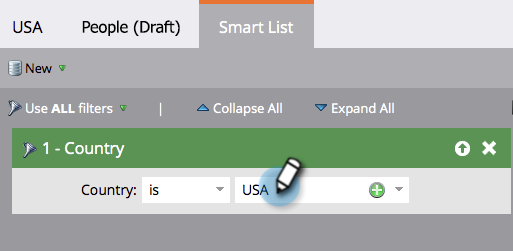
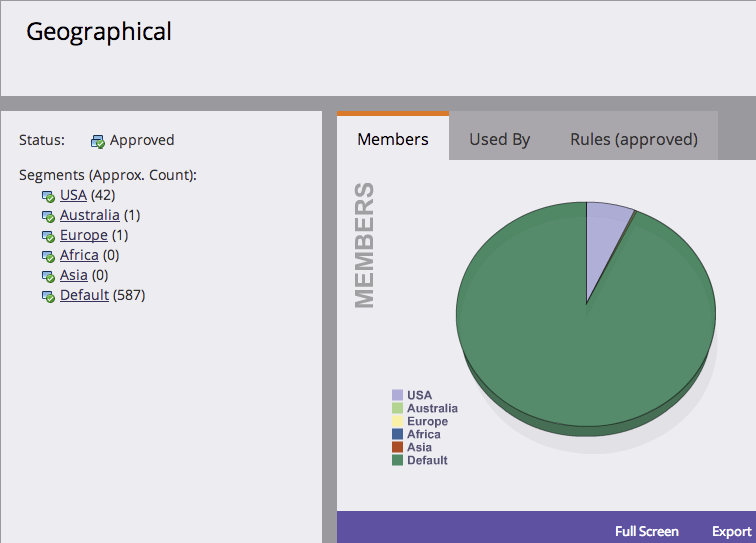

# Definir regras de segmento {#define-segment-rules}

A definição de Regras de segmento permite categorizar suas pessoas em diferentes grupos mutuamente exclusivos.

>[!PREREQUISITES]
>
>[Criar uma segmentação](/help/marketo/product-docs/personalization/segmentation-and-snippets/segmentation/create-a-segmentation.md)

1. Vá para o **[!UICONTROL Banco de Dados]**.

   

1. Selecione **[!UICONTROL Segmentações]** na árvore e clique em um **Segmento** específico.

   

1. Clique em **[!UICONTROL Smart List]** e adicione filtros.

   

   >[!CAUTION]
   >
   >Atualmente, os segmentos não oferecem suporte aos operadores _No Passado_ e _No Período_ em filtros. Isso ocorre porque as segmentações só verificam atualizações quando um valor de dados de alteração é registrado. Esses valores são _não_ registrados para coisas que mudam automaticamente, como campos de fórmulas e datas. Além disso, operadores de data com intervalos de datas relativos não são compatíveis, pois são calculados no momento da aprovação da segmentação, não no momento de uma atividade Alterar valor de dados.

   >[!NOTE]
   >
   >No momento, os filtros &quot;Tipo de SFDC&quot; e &quot;Tipo de Microsoft&quot; não são compatíveis com as listas inteligentes de segmentação.

1. Preencha os valores apropriados para os filtros.

   

   >[!CAUTION]
   >
   >O comportamento do registro de atividades para campos de Conta pode afetar a qualificação. Portanto, desaconselhamos o uso de campos Account ao definir regras de segmento.

1. Clique na guia **[!UICONTROL Pessoas (Rascunho)]** para exibir as pessoas que podem se qualificar para serem membros deste segmento.

   

1. Vá para **[!UICONTROL Ações de segmentação]**. Clique em **[!UICONTROL Aprovar]**.

   

   >[!CAUTION]
   >
   >O número total de segmentos que você pode criar em uma segmentação depende do número e do tipo de filtros usados e também da complexidade da lógica dos seus segmentos. Embora você possa criar até 100 segmentos usando campos padrão, usar outros tipos de filtros pode aumentar a complexidade e sua segmentação pode deixar de ser aprovada. Alguns exemplos são: campos personalizados, membro de lista, campos de proprietário de lead e estágios de receita.
   >
   >Se você receber uma mensagem de erro durante a aprovação e precisar de assistência para reduzir a complexidade da segmentação, contate o [Suporte da Marketo](https://nation.marketo.com/t5/Support/ct-p/Support).

1. Confira o painel para obter uma visão geral rápida dos segmentos em um gráfico de pizza, bem como as regras aplicadas.

   

Bom trabalho! Esses segmentos serão úteis em vários lugares do Marketo.

>[!NOTE]
>
>Uma pessoa pode se qualificar para diferentes segmentos, mas eventualmente pertence a apenas um que depende da [ordem de prioridade dos segmentos](/help/marketo/product-docs/personalization/segmentation-and-snippets/segmentation/segmentation-order-priority.md).

>[!NOTE]
>
>A tela [!UICONTROL Pessoas (Rascunho)] mostra todas as pessoas que se qualificam para serem membros e nem sempre é a lista final de pessoas. Aprove seu segmento para ver a lista final.

>[!MORELIKETHIS]
>
>[Aprovar uma segmentação](/help/marketo/product-docs/personalization/segmentation-and-snippets/segmentation/approve-a-segmentation.md)
