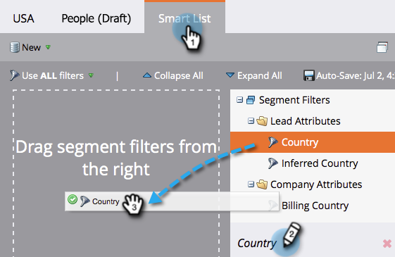

# Definir regras de segmento {#define-segment-rules}

A definição das Regras de segmento permite que você categorize suas pessoas em grupos mutuamente exclusivos diferentes.

>[!PREREQUISITES]
>
>[Criar uma segmentação](create-a-segmentation.md)

1. Vá para o **Banco de Dados.**

   

1. Clique na **Segmentação **da árvore e, em seguida, clique em um **Segmento** específico.

   

1. Clique em **Lista inteligente** e adicione filtros.

   

   >[!CAUTION]
   >
   >No momento, os segmentos não são compatíveis com os operadores *Em Anterior* e *Em tempo limite *em filtros. Isso ocorre porque as segmentações só verificam atualizações quando um valor de dados de alteração é registrado. Esses valores estão *não* registrados para itens que mudam automaticamente, como campos de fórmula e datas. Além disso, os operadores de data com intervalos de data relativos não são suportados, pois são calculados no momento da aprovação da segmentação, não no momento de uma atividade Alterar valor de dados.

   >[!NOTE]
   >
   >Os filtros &quot;Tipo SFDC&quot; e &quot;Tipo Microsoft&quot; não são suportados atualmente em listas inteligentes de segmentação.

1. Preencha os valores apropriados para os filtros.

   

   >[!NOTE]
   >
   >**Mergulho profundo**
   >
   >
   >Listas inteligentes são incríveis. Saiba tudo o que você pode fazer com [Listas inteligentes e Listas estáticas](http://docs.marketo.com/display/docs/smart+lists+and+static+lists).

1. Clique na guia **Pessoas (Rascunho)** para visualização das pessoas que podem se qualificar para serem membros deste segmento.

   

1. Vá para **Ações de segmentação**. Clique em **Aprovar**.

   

   >[!CAUTION]
   >
   >O número total de segmentos que você pode criar em uma segmentação depende do número e do tipo de filtros usados e também da complexidade da lógica de seus segmentos. Embora seja possível criar até 100 segmentos usando campos padrão, o uso de outros tipos de filtros pode aumentar a complexidade e sua segmentação pode falhar na aprovação. Alguns exemplos são: campos personalizados, membro da lista, campos do proprietário do cliente potencial e estágios da receita.
   >
   >
   >Se você receber uma mensagem de erro durante a aprovação e precisar de ajuda para reduzir a complexidade da segmentação, entre em contato com o [Suporte do Marketing](http://nation.marketo.com/t5/Support/ct-p/Support).

1. Verifique o painel para obter uma visão geral rápida dos segmentos em um gráfico de pizza, bem como as regras aplicadas.

   

Bom trabalho! Esses segmentos vão ser úteis em muitos lugares de Marketo.

>[!NOTE]
>
>Uma pessoa pode se qualificar para diferentes segmentos, mas eventualmente pertence a apenas um que depende da ordem de prioridade [dos segmentos](segmentation-order-priority.md).

>[!NOTE]
>
>**Lembrete**
>
>A tela Pessoas (rascunho) mostra todas as pessoas que se qualificam para serem membros e nem sempre é a lista final das pessoas. Aprove seu segmento para ver a lista final.

>[!MORELIKETHIS]
>
>* [Aprovar uma segmentação](approve-a-segmentation.md)

>

