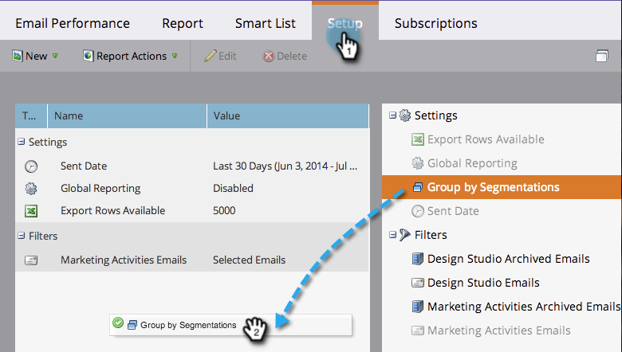

# Agrupar relatórios de email por segmentações {#group-email-reports-by-segmentations}

As segmentações não se destinam apenas ao conteúdo dinâmico. Também é possível agrupar o relatório de desempenho de email por segmentações.

>[!PREREQUISITES]
>
>[Aprovar uma segmentação](/help/marketo/product-docs/personalization/segmentation-and-snippets/segmentation/approve-a-segmentation.md)

1. Vá para a área **[!UICONTROL Atividades de marketing]** (ou **[!UICONTROL Analytics]**).

   

1. Selecione seu relatório de **[!UICONTROL Desempenho do email]**.

   

1. Clique na guia **[!UICONTROL Configuração]** e arraste sobre **[!UICONTROL Agrupar por Segmentações]**.

   

1. Escolha uma ou duas segmentações para usar no agrupamento do relatório. Clique em **[!UICONTROL Aplicar]**.

   

1. Pronto! Clique na guia **[!UICONTROL Relatório]**. Se você usar uma segmentação, seu relatório mostrará uma linha para cada segmento.

   

1. Se você usar duas segmentações, ela mostrará uma linha para cada _combinação_ de segmentos.

   

>[!MORELIKETHIS]
>
>[Filtrar Assets em um Relatório de Email](/help/marketo/product-docs/reporting/basic-reporting/report-activity/filter-assets-in-an-email-report.md)
