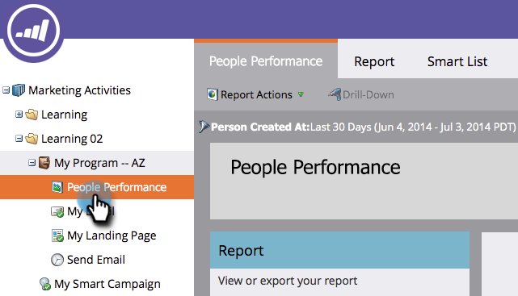

# Agrupar relatórios de pessoas por segmento {#group-person-reports-by-segment}

Você pode agrupar seus relatórios pessoais por qualquer segmento definido em suas segmentações.

1. Vá para a seção **Atividades de marketing** (ou **Analytics**).

   

1. Selecione seu relatório de pessoa na árvore de navegação.

   

1. Clique na guia **Configuração** e clique duas vezes em **Agrupar pessoas por**.

   

   >[!NOTE]
   >
   >Você também pode [agrupar seus relatórios de pessoa por atributo de pessoa ou de empresa](/help/marketo/product-docs/reporting/basic-reporting/report-activity/group-person-reports-by-attribute.md).

1. Na caixa de diálogo **Agrupar pessoas por**, comece digitando &#39;Segmentação&#39; na caixa de texto. Quando o cabeçalho **Segmentações** for exibido, selecione um na lista abaixo do cabeçalho.

   

1. Clique na guia **Relatório** para ver seu relatório agrupado pelo segmento selecionado.

   

>[!MORELIKETHIS]
>
>[Adicionar colunas personalizadas a um relatório de pessoa](/help/marketo/product-docs/reporting/basic-reporting/editing-reports/add-custom-columns-to-a-person-report.md)
