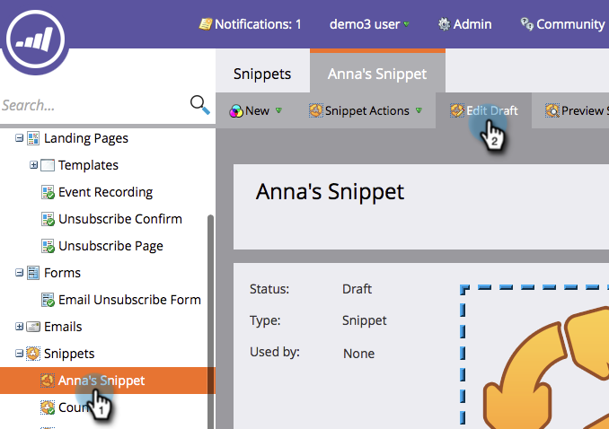

# Adicionar conteúdo a um trecho {#add-content-to-a-snippet}

>[!PREREQUISITES]
>
>[Criar um trecho](/help/marketo/product-docs/personalization/segmentation-and-snippets/snippets/create-a-snippet.md)

É possível adicionar tokens, imagens, arquivos ou rich text a um trecho.

>[!NOTE]
>
>Você não pode incorporar nenhuma [sintaxe de email do Marketo](/help/marketo/product-docs/email-marketing/general/email-editor-2/email-template-syntax.md) em trechos; isso **não** funcionará em um email. Os trechos devem ser apenas conteúdo do corpo (HTML + TEXT).

1. Vá para o **Design Studio**.

   

1. Selecione seu **trecho** e clique em **Editar rascunho**.

   

Você pode adicionar três tipos de conteúdo a um trecho.

## Adicionar token {#add-token}

1. Arraste e solte o elemento **Token**.

   

1. Insira o **Token** e clique em **Inserir**.

   

## Adicionar imagem/arquivo {#add-image-file}

1. Arraste e solte o elemento **Image/File**.

   

   >[!NOTE]
   >
   >Você pode adicionar suas próprias imagens ou arquivos ao Marketo. Saiba mais sobre [imagens e arquivos](/help/marketo/product-docs/demand-generation/images-and-files/add-images-and-files-to-marketo.md).

1. Selecione a **Imagem** a ser usada e clique em **Inserir**.

   

   >[!NOTE]
   >
   >Também é possível pesquisar uma imagem específica se você souber o nome dela.

## Adicionar texto {#add-text}

1. Digite na área Versão do HTML para adicionar texto.

   

   >[!TIP]
   >
   >Use as ferramentas de formatação para personalizar o texto.

1. Para Emails, clique na guia **Versão do Texto**.

   

1. Clique em **Copiar do HTML**.

   

   >[!NOTE]
   >
   >Imagens, links e formatação são removidos na Versão de texto.

Legal! Agora você pode criar uma variedade de conteúdo para o seu trecho.

>[!MORELIKETHIS]
>
>* [Visualizar um trecho](/help/marketo/product-docs/personalization/segmentation-and-snippets/snippets/preview-a-snippet.md)
>* [Aprovar um trecho](/help/marketo/product-docs/personalization/segmentation-and-snippets/snippets/approve-a-snippet.md)
