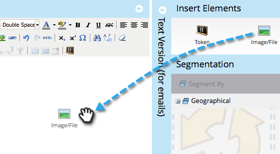

# Adicionar conteúdo a um fragmento {#add-content-to-a-snippet}

>[!PREREQUISITES]
>
>[Criar um trecho](/help/marketo/product-docs/personalization/segmentation-and-snippets/snippets/create-a-snippet.md)

Você pode adicionar tokens, imagens, arquivos ou rich text a um snippet.

>[!NOTE]
>
>Não é possível incorporar [sintaxe de email do Marketo](/help/marketo/product-docs/email-marketing/general/email-editor-2/email-template-syntax.md) em trechos; ele **não** funcionará em um email. Os trechos devem ser apenas conteúdo de corpo (HTML + TEXT).

1. Vá para o **Design Studio**.

   

1. Selecione seu **Snippet** e clique em **Editar rascunho**.

   

É possível adicionar três tipos de conteúdo a um snippet.

## Adicionar token {#add-token}

1. Arraste e solte o elemento **Token**.

   

1. Digite **Token** e clique em **Inserir**.

   

## Adicionar imagem/arquivo {#add-image-file}

1. Arraste e solte o elemento **Image/File**.

   

   >[!NOTE]
   >
   >Você pode adicionar suas próprias imagens ou arquivos ao Marketo. Saiba mais sobre [imagens e arquivos](/help/marketo/product-docs/demand-generation/images-and-files/add-images-and-files-to-marketo.md).

1. Selecione a **Imagem** a ser usada e clique em **Inserir**.

   

   >[!NOTE]
   >
   >Você também pode procurar por uma imagem específica se souber seu nome.

## Adicionar texto {#add-text}

1. Digite a área Versão HTML para adicionar texto.

   

   >[!TIP]
   >
   >Use as ferramentas de formatação para personalizar o texto.

1. Para e-mails, clique na guia **Versão do texto**.

   

1. Clique em **Copiar de HTML**.

   

   >[!NOTE]
   >
   >Imagens, links e formatação são removidos na Versão do texto.

Legal! Agora você pode criar uma variedade de conteúdo para seu Snippet.

>[!MORELIKETHIS]
>
>* [Pré-visualização de um fragmento](/help/marketo/product-docs/personalization/segmentation-and-snippets/snippets/preview-a-snippet.md)
>* [Aprovar um trecho](/help/marketo/product-docs/personalization/segmentation-and-snippets/snippets/approve-a-snippet.md)

