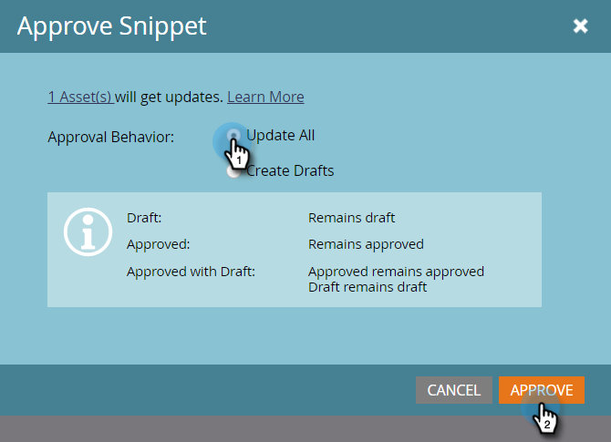

# Aprovar um trecho sem rascunho {#approve-a-snippet-with-no-draft}

## Aprovar o trecho {#approve-the-snippet}

Nenhum rascunho é acionado sempre que um snippet é aprovado. Isso inclui um trecho que é compartilhado ou referenciado por ativos em outros espaços de trabalho.

1. Vá para o **Design Studio**.

   

1. Selecione um snippet e, no menu suspenso Ações **de** snippet, escolha **Aprovar**.

   

1. Selecione uma opção na caixa de diálogo Aprovar fragmento e clique em **Aprovar**:

   * **Atualizar tudo**: Essa opção não criará rascunhos dos ativos aprovados usando o snippet. Todos os ativos obtêm as atualizações e mantêm seus status anteriores. Aparece um módulo de progresso no lado superior direito do ecrã; pode ser fechado a qualquer momento. Para restaurá-lo, clique com o botão direito do mouse no nome do snippet e selecione Mostrar status de aprovação.
   * **Criar rascunhos**: Essa opção criará rascunhos dos ativos aprovados usando o snippet. Selecione essa opção se as alterações no fragmento precisarem ser revisadas primeiro. Todos os rascunhos devem ser aprovados manualmente.

   

   >[!NOTE]
   >
   >Para um novo snippet que ainda não foi usado, essa tela Aprovar rascunho não é exibida. Ele aparece quando o fragmento é usado em um ou mais ativos.

>[!CAUTION]
>
>Este recurso foi criado para economizar tempo com o fluxo de trabalho de aprovação de fragmento. No entanto, há algumas limitações para se ter em mente. Consulte [este documento](https://nation.marketo.com/docs/DOC-4415) para obter detalhes. O documento também contém informações sobre manipulação e solução de problemas de erros.

>[!NOTE]
>
>**Artigos relacionados**
>
>[Ativar Sem rascunho para trechos](../../../../product-docs/administration/users-and-roles/managing-user-roles-and-permissions/enable-no-draft-for-snippets.md)

