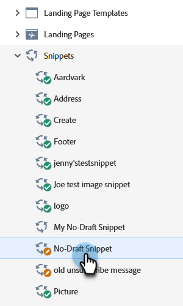

# Aprovar um snippet sem rascunho {#approve-a-snippet-with-no-draft}

## Aprovar o trecho {#approve-the-snippet}

Nenhum rascunho é acionado sempre que um trecho é aprovado. Isso inclui um trecho compartilhado ou referenciado por ativos em outros espaços de trabalho.

1. Vá para o **[!UICONTROL Design Studio]**.

   

1. Localize e selecione o trecho desejado.

   

1. No menu suspenso **[!UICONTROL Ações de trecho]**, escolha **[!UICONTROL Aprovar rascunho]**.

   

1. Selecione uma opção na caixa de diálogo Aprovar trecho e clique em **[!UICONTROL Aprovar]**:

   * **[!UICONTROL Atualizar tudo]**: essa opção não criará rascunhos dos ativos aprovados usando o trecho. Todos os ativos obtêm as atualizações e mantêm seus status anteriores. Um módulo de progresso é exibido no lado superior direito da tela; ele pode ser fechado a qualquer momento. Para restaurá-lo, clique com o botão direito do mouse no nome do trecho e selecione Mostrar status de aprovação.
   * **[!UICONTROL Criar rascunhos]**: essa opção criará rascunhos dos ativos aprovados usando o trecho. Selecione esta opção se as alterações do trecho precisarem ser revisadas primeiro. Todos os rascunhos devem ser aprovados manualmente.

   

   >[!NOTE]
   >
   >Para um novo trecho que ainda não foi usado, esta tela Aprovar rascunho não é exibida. Ele é exibido quando o trecho é usado em um ou mais ativos.

>[!CAUTION]
>
>Esse recurso foi projetado para economizar tempo com o fluxo de trabalho de aprovação de trecho. No entanto, há algumas limitações que devem ser observadas. Consulte [este artigo](https://nation.marketo.com/t5/knowledgebase/no-draft-snippet-limitations-and-troubleshooting/ta-p/300799){target="_blank"} para obter detalhes.

>[!MORELIKETHIS]
>
>[Habilitar Não Rascunho para Trechos](/help/marketo/product-docs/administration/users-and-roles/enable-no-draft-for-snippets.md){target="_blank"}
